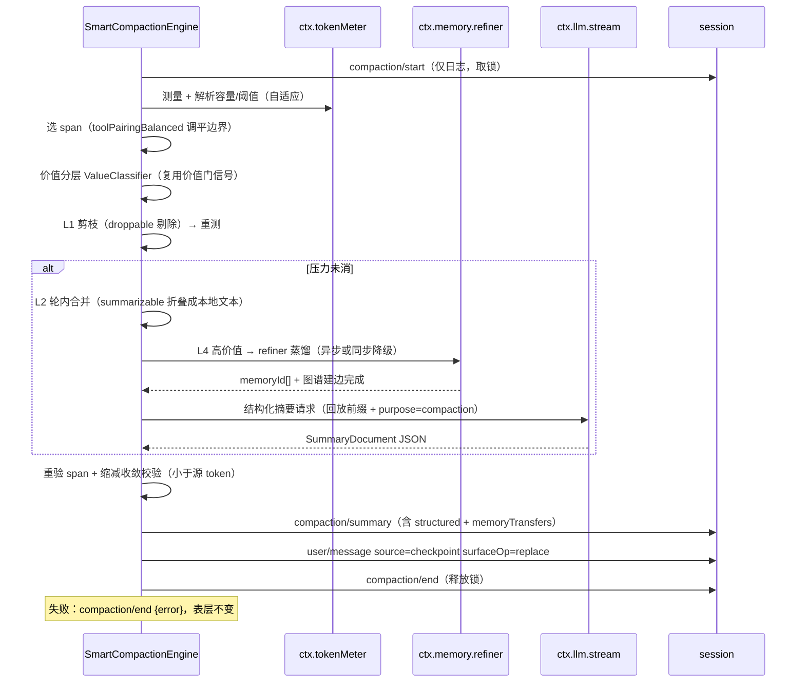

# DSH 精妙压缩插件方案（dsh-compaction-smart）

> 目标：以同一 `CompactionEngine` seam 提供一个**内容感知、记忆闭环、结构化、分级渐进、自适应、可展开**的压缩 Provider，替代 `dsh-compaction-basic` 的时间序一刀切模型。
> 核心差异化：**压缩 = 记忆转移**——被遮蔽的高价值内容不是「摘要然后消失」，而是「先进长期记忆、再被摘要、留下锚点、未来由注入带回」。

---

## 0. 现状复盘（为什么不足）

`compaction-basic` 已经在 seam 约定、KV 复用、锁/生命周期、溢出恢复上做得严谨（这些**全部保留**）。真正的短板在**策略层**：

| 维度 | compaction-basic（现状） | dsh-compaction-smart（本方案） |
|---|---|---|
| 保留维度 | **时间序唯一**：最旧 N 压缩、近期尾部逐字保留 | **内容感知分层**：按每单元的「信息价值」分层，未完成 todo/用户要求/目标逐字保留，过程往返可摘要，空输出/重复/被覆盖快照直接丢弃 |
| 摘要内容 | **无选择一锅炖**：整段全部塞给摘要器 | **按价值分层后再送**：丢弃层不进摘要、逐字层不进摘要、只摘要「可摘要层」+ 结构化骨架 |
| 摘要去向 | **摘要即终点**：被压内容除日志外无处可去 | **记忆转移闭环**：高价值内容先 `refiner` 蒸馏入库 + 图谱建边，摘要内留 `memory_refs` 锚点，未来由注入带回 |
| 摘要格式 | **自由文本** Markdown 九段式 | **结构化 JSON**（facts/ongoing/requirements/lessons/done/memory_refs），可合并、可引用、可被图谱消费 |
| 压缩次数 | 单级（一次性摘要整段最旧范围） | **四级渐进**（L1 剪枝 → L2 轮内合并 → L3 跨轮结构化摘要 → L4 记忆转移+激进压缩），逐级触发、逐级降级 |
| 阈值 | 固定 `thresholdRatio`/`retainRatio` | **自适应**：随上下文增长率、任务阶段（决策期保守/收尾期激进）、摘要成本 vs KV 收益动态调整 |
| 可回看 | 无（被遮蔽段只剩日志原始事件） | **压缩世界线**：`context_expand` 工具按需展开被遮蔽原始段，摘要合并保留 parent 链 |

约束核对结论（全部满足）：

- ✅ 同一 seam：`compactIfNeeded`/`compactNow`/`compactRegion` 签名与 `CompactionResult` 语义不变，作为 Provider 替换，配置只换插件名 + policy。
- ✅ 摘要是直接 `ctx.llm.stream()`，逐字回放系统提示词/工具/被遮蔽消息，`purpose='compaction'`，只取文本（排除 reasoning/tool calls），KV 热前缀复用（与 basic 完全一致）。
- ✅ 工具配对边界：切分点用 `toolPairingBalancedBefore/After` 调平，不可破。
- ✅ 生命周期：`compaction/start` → 摘要 → 重验 → `compaction/summary`+替换 → flush；失败表层不变。
- ✅ 溢出恢复路径保留。
- ✅ `ctx.memory` 作为简化门面（store/search/add/update/versions/stats），必要时扩展接口（见 §8）。

---

## 1. 架构总览

```mermaid
graph TB
    subgraph Trigger["触发与测量"]
        TM["ctx.tokenMeter 压力"]
        OF["provider context-overflow"]
        MAN["/compact · compactNow"]
    end

    subgraph Policy["SmartCompactionEngine（本插件）"]
        GATE["价值分层器 ValueClassifier<br/>复用 dsh-memory 价值门信号表"]
        HIST["历史测量期<br/>增长率 / 任务阶段】
        ADAP["自适应阈值控制器<br/>AdaptiveThreshold"]
        KEEP["L1 剪枝<br/>丢弃层 + 超大工具结果"]
        MERGE["L2 轮内合并<br/>过程往返折叠"]
        L3["L3 结构化摘要<br/>总结可摘要层 → JSON"]
        L4["L4 记忆转移<br/>高价值 → refiner → 图谱建边<br/>摘要留 memory_refs 锚点"]
        CHECK["重验 + 缩减收敛校验"]
    end

    subgraph Mem["dsh-memory 联动"]
        REF["ctx.memory refiner 蒸馏"]
        STORE["MemoryStore.add/update"]
        GRAPH["nodes/edges 八型建边"]
    end

    subgraph Other["其他"]
        EXPAND["context_expand 世界线展开"]
        LOG["append-only 日志（被遮蔽原始段）"]
    end

    TM --> GATE
    OF --> GATE
    MAN --> GATE
    GATE --> KEEP --> MERGE --> L3 --> L4
    GATE -.价值评分.-> MEM
    L4 --> REF --> STORE --> GRAPH
    L4 -.锚点.-> L3
    HIST --> ADAP --> GATE
    L3 --> CHECK
    CHECK -->|表层替换| EXPAND
    CHECK -->|原始事件| LOG
```

---

## 2. 数据模型

### 2.1 表面单元价值分层（ValueClass）

```ts
/** 每个表层事件单元打上的价值标签，是后续所有分级的剪枝依据。 */
type ValueClass =
  | 'verbatim'      // 必须逐字保留：未完成 todo、用户显式要求、当前目标、纠正/约束
  | 'high'          // 高价值：决策/结论/教训/偏好/关键事实 —— 记忆转移候选
  | 'summarizable'  // 可摘要：过程往返、多轮试错、工具中间输出
  | 'droppable'     // 可丢弃：空输出、重复内容、已被后续覆盖的快照、纯噪音

interface ValueScore {
  class: ValueClass
  score: number          // 0..1，来自价值门信号加权（见 §5.1）
  reasons: SignalHit[]   // 命中的信号审计（可解释、可调试）
}

interface SurfaceUnit {
  seq: number                 // 表层事件 seq（start..end）
  event: SurfaceEvent         // user/message | assistant/message | tool/result
  value: ValueScore
  tokens: number              // tokenMeter 估算该单元 token
  keeper: 'verbatim' | 'memory' | 'summary' | 'drop'   // 最终处置
  anchorSeq?: number          // 若入摘要/记忆，指向其锚点
}
```

### 2.2 结构化摘要 Schema（SummaryDocument）

```ts
/**
 * 结构化摘要。替换 <compacted-summary> 自由文本。
 * 兼容：仍是一个字符串字段 `compact`（进入 user/message 文本 + compaction/summary 事件），
 * 但结构为固定 JSON，便于合并、引用、图谱消费。
 */
interface SummaryDocument {
  schema: 'dsh-compaction-smart@1'
  compactionId: string          // 关联 compaction/* 事务
  seqRange: { start: number; end: number }
  parentSummaryIds: string[]    // 合并链：之前检查点的 compactionId（世界线 parent 链）
  createdMs: number

  facts:       Fact[]           // 事实/状态：当前代码/配置/环境状态
  ongoing:     Ongoing[]        // 进行中：未完成工作、待办、下一步（verbatim 层内容的精炼镜像）
  requirements: Requirement[]   // 用户要求/约束/偏好/纠正（verbatim 层，尽量逐字）
  lessons:     Lesson[]         // 教训/踩坑/决策依据（high 层蒸馏）
  done:        Done[]           // 已完成事项（防重复劳动，供 dedup）
  decisions:   Decision[]       // 决策与理由（high 层）
  memory_refs: MemoryRef[]      // 已转移进长期记忆的锚点（核心差异化，见 §6）
}

interface MemoryRef {
  memoryId: string             // dsh-memory 的 id（mem-xxxx）
  kind: ValueClass              // 来源价值层（high/verbatim）
  pointer: string               // 摘要内的一句话指引："决策：采用 bcrypt cost=12 → 详见记忆"
  revised?: boolean             // 是否 update 了已有记忆（世界线推进）
}

interface Fact        { k: string; v: string }               // "k":"依赖注入方案", "v":"cordis ctx.plugin"
interface Ongoing     { what: string; next: string }         // 待办 + 下一步动作
interface Requirement { constraint: string; quote?: string; priority: 'must'|'should' }
interface Lesson      { issue: string; fix: string }
interface Done        { what: string; at?: string }
interface Decision    { choice: string; rationale: string; alternatives?: string[] }
```

### 2.3 `compaction/summary` 事件扩展

basic 已在 `compaction/summary` 上保留 `summary/range/summarizedSeq/tokens/call envelope`。smart 追加结构化负载（可选字段，向后兼容）：

```ts
interface CompactionSummaryEventExtra {
  structured: SummaryDocument       // 结构化摘要（smart 特有）
  memoryTransfers: Array<{          // 记忆转移记录（smart 特有）
    memoryId: string
    op: 'add' | 'update'
    revision?: number
    valueClass: 'high' | 'verbatim'
  }>
  classification: Array<{ seq: number; keeper: string; score: number }>  // 分层审计
}
```

原始自由文本 `summary` 仍写一份（`SummaryDocument` 渲染成的稳定文本），供旧消费者与 `<compacted-summary>` 展示自洽；`structured` 是权威机读结构。

### 2.4 压缩世界线（Worldline）

被遮蔽原始段**不销毁**，只从表层移除，仍留在 append-only 日志。为支持按需展开，在日志/索引中维护：

```ts
interface CompactionWorldline {
  compactionId: string
  seqRange: { start: number; end: number }
  parentSummaryIds: string[]
  levelsApplied: number[]        // 实际执行的 L1..L4 序列
  memoryRefs: string[]           // 转移记忆 id
  summaryDoc: SummaryDocument
}
```

维护位置：`compaction/summary` 事件本身就是权威记录（含 range/summarizedSeq）。smart 额外在内存维护 `Map<compactionId, CompactionWorldline>`（会话级），并为 `context_expand` 提供按 seq 反向定位 compaction 的索引。持久化依赖日志回放重建（确定性），无需新建表。

---

## 3. 事件流与生命周期

遵循 seam 的表层约定（`compaction/*` 不进表层，成功压缩只产生一个 `replace` 表层变更）。smart 生命周期与 basic 同构，只在「准备 span」与「摘要」之间插入分层+记忆转移：



关键不变式：
- 摘要请求在 `compaction/start` 之后、`compaction/summary` 之前，与 basic 一致，`llm/stream` 处可拦截。
- 记忆转移（L4）**先于**摘要：确保被压缩的高价值内容「先进库再消失」，即使后续摘要失败、表层回退，记忆已安全落库（幂等，见 §6.4）。
- 溢出恢复：provider 报 `CONTEXT_WINDOW_EXCEEDED` → 跳过常规阈值，直接 L1 剪枝 + 最大平衡头部缩减，遵守 `surface.replaceGeneration` 前进才重试的既有约定。

---

## 4. 内容感知分层价值判定（维度一）

### 4.1 总原则

替代「时间序是唯一维度」：**逐应用户意图语义**（未完成工作、约束、目标方向的延续）优先于时间新鲜度。近期尾部的「空输出/重复/被覆盖」不再享有逐字保留特权，而较早范围里若夹着「未闭合的 todo / 用户明确要求」，即使跨越压缩切分也要**逐字保留**（提升为 verbatim，允许跨范围前移）。

### 4.2 分级判定的信号来源

复用 dsh-memory 价值门信号表（§3.1 of memory-plugin-proposal），但**作用对象从「turn 整体」细化为「单条表层单元」**，并新增压缩专属信号：

| 信号 | 权重 | 分层 | 检测点 |
|---|---|---|---|
| 含决策表述（决定/采用/选择…） | +高 | high | 文本正则 + 结构（assistant 输出结论段） |
| 含结论（结果/验证通过/修复了…） | +高 | high | 同上 |
| 含偏好（我更倾向/不喜欢/习惯…） | +高 | high | 同上 |
| 含失败教训（踩坑/失败/错误/不要…） | +高 | high | 同上 + tool/result 错误堆栈 |
| 含**未完成 todo/待办/下一步** | +高 | verbatim | checkbox 语法 / "TODO:" / "接下来" / 未闭合任务 |
| 含**用户显式要求/纠正/约束** | +极高 | verbatim | user/message source.kind==='user' 且含指令动词 |
| 含**当前目标/任务方向声明** | +极高 | verbatim | 任务起始 user 消息 / "目标" 段 |
| 空输出 / 纯确认 / "ok" | -高 | droppable | 输出 token < ε 且无语义 |
| 与后续单元重复（信息已被覆盖） | -高 | droppable | 与后面单元 Jaccard/结构相似 > 阈值 |
| 被覆盖快照（文件状态被新版覆盖） | -高 | droppable | 同路径 diff 快照，取最新 |
| 纯过程往返（多轮试错中间态） | 中性 | summarizable | 其余默认 |

### 4.3 与 dsh-memory 的复用边界（不重复造轮子）

- **信号表复用**：`ValueClassifier` 直接消费 dsh-memory 的**信号定义**（规则打分，离线）。dsh-memory 若已把价值门模块化为可导出函数，smart 调用它；否则 smart 内实现**同一信号表**（单源同步在提案中约定，避免漂移，见 §12 风险 2）。
- **分层与价值门是同一个评分的两个投影**：dsh-memory 用 score 决定「要不要入库」，smart 用 score 决定「怎么处置」。同一 `ValueScore.score`，dsh-memory 过 `valueGate` 阈值入库，smart 过类型阈值分到 verbatim/high/summarizable/droppable。
- **图谱复用**：high 层在 transfer 时直接走 `ctx.memory` 的 `graphLink`（mentions 共现），升级时可产 `causes/solves/contradicts/partOf` 等语义边（见 §6.3）。

---

## 5. 压缩 = 记忆转移闭环（维度二，核心差异化）

### 5.1 转移协议（顺序保证「先进库再消失」）

1. **候选**：`keeper==='memory'` 的单元（high + 部分 verbatim 的蒸馏镜像）被提取为「记忆候选」。
2. **蒸馏**：调用 `ctx.memory.refiner`（复用 `extractWithLlm`，配置独立 refiner 模型，降级规则路径）。refiner 输出 `{content,type,layer,keywords}`。
3. **入库 + 建边**：走 `ctx.memory` 的 add/update（复用 valueGate + dedupMerge，`jaccard>=0.8` 更新而非新建）→ 图谱 `graphLink`。
4. **锚点回填**：得到 `memoryId`，写回 `SummaryDocument.memory_refs`。
5. **摘要**：摘要器（L3）被告知「以下内容已存入长期记忆」，只需在摘要中留指引锚点，不重复全文。

### 5.2 锚点格式（兼容 `<compacted-summary>` 渲染）

替换 user 消息文本中，`<compacted-summary>` 块内追加 memory 段：

```markdown
<compacted-summary>
{"schema":"dsh-compaction-smart@1", ...}
## 已存入长期记忆（dsh-memory）
- 决策：采用 bcrypt cost=12 → [{memory} mem-a1b2c3d4]
- 教训：不要在生产改 cordis.patch.yml → [{memory} mem-e5f6g7h8]
</compacted-summary>
```

模型读到锚点即可在需要时通过 `memory_search`/注入取回全文；future 由 `agent/pre-step` 注入自动带回（沿用 dsh-memory 注入通道）。

### 5.3 图谱建边（呼应八型）

转移时按内容类型产边（复用 memory-plugin-proposal §6.2 语义）：

| 记忆内容 | 边 | 方向 |
|---|---|---|
| 一次「修复/解决问题」 | `solves` | 解法 → 问题 |
| 一次「因果/导致」 | `causes` | 因 → 果 |
| 与已有记忆高度相似 | `similarTo` | 对称 |
| 属于某主题/项目 | `partOf` | 子 → 整体 |
| 时间演进的结论更新 | `before`（世界线） | 旧 → 新 |
| 支持/印证某结论 | `supports` | 证据 → 结论 |
| 推翻旧结论 | `contradicts` | 新 → 旧 |

`contradicts` 是「知识过时/翻案」信号，直接喂给 dsh-memory 的世界线更新（`update` 追加版本、旧版隐藏）——压缩转移与记忆世界线在语义上打通。

### 5.4 幂等与降级

- 记忆转移**幂等**：同一 compaction 若因摘要失败整体回退并重试，refiner 结果靠 dedupMerge（Jaccard≥0.8 更新）保证不重复入库。
- **降级路径**：refiner LLM 失败 → 规则路径（直接用 value.score 与文本截断入库），不阻塞压缩主流程。

---

## 6. 结构化摘要（维度三）

### 6.1 为什么优于自由文本

| 优点 | 说明 |
|---|---|
| **可合并（reduce 闭包）** | 两次摘要的 `facts/ongoing/requirements/lessons/done` 可按 `k`/`what` 键合并、冲突取新（呼应 basic 的「合并 previous checkpoint」能力，但结构可精确比对而非自由文本重写） |
| **模型可结构化引用** | 后续轮次可按字段检索（「当前 ongoing 是什么」「有哪些 requirements」），而非从一段散文里再解析 |
| **图谱可消费** | `facts`→node(state)、`decisions`→node(event)、`memory_refs`→边，摘要本身成为图谱的一阶输入 |
| **验证可机检** | JSON schema 校验（`schemastery` z.object）保证摘要器不丢字段、不改结构，杜绝自由文本漂移 |

### 6.2 与现有事件的兼容格式

- **`compaction/summary` 事件**：`summary` 字段仍为渲染文本（`SummaryDocument` 的稳定文本化），向后兼容；追加 `structured`（机读 JSON，同事件另一个字段）。
- **`<compacted-summary>` 标签**：保留（basic 已用它标记检查点上下文），内部从 Markdown 九段式改为 JSON + 锚点段。下游若依赖九段式标题（如 `/compact` 展示），smart 提供文本投影（把 JSON 渲染成与 basic 同结构的九段式），保证展示层零改动。
- **摘要合并**：smart 合并时对 `structured` 做**字段级 merge**（不是文本重写），`parentSummaryIds` 追加，形成世界线 parent 链。

### 6.3 摘要器指令（最终 user 消息）结构

摘要是直接 `ctx.llm.stream()`，逐字回放前缀复用 KV，追加最终指令要求输出严格 JSON（复用 basic 的「只输出 checkpoint、不调用工具」纪律），只取 `text-delta`，排除 reasoning/tool calls（与 basic 一致）。指令要求输出 `SummaryDocument` 的 JSON，空段写 `[]`，永不丢字段。

---

## 7. 渐进式多级压缩（维度四）

四级均幂等、可降级。每级触发基于「压力已消解则停止」原则：

| 级 | 名称 | 触发条件 | 处置对象 | 产物 | 降级路径 |
|---|---|---|---|---|---|
| **L1** | 工具结果剪枝 | 压力 > 阈值 / provider 溢出 | droppable（空/重复/被覆盖快照）+ 超大 tool/result 文本主体 | 表层裁剪（仍要摘要时在 pruner 已就位下） | 若无 droppable → 直接到 L2 |
| **L2** | 轮内合并 | L1 后压力未消 | summarizable 的过程往返，折叠为「本地一行结论」（非 LLM，纯规则去重/取最新快照） | 减少送入摘要器的 token | 规则难判定 → 交给 L3 |
| **L3** | 跨轮结构化摘要 | L2 后仍超阈值 或 常规触发 | summarizable + 已记忆转移条目的锚点化 | `SummaryDocument` JSON + `replace` | 摘要失败 → 表层不变（basic 语义） |
| **L4** | 记忆转移 + 激进压缩 | 摘要后仍超阈值（header 收敛不足）或 `compactionRetries` 内需更狠 | high/verbatim 的蒸馏镜像 → 入库，表层更激进地遮蔽 | 更短摘要 + `memory_refs` | 记忆路径失败 → 规则入库或跳过转移，仅摘要 |

**各级只在前级未消解压力时推进**，避免无谓成本。L2 是**纯规则、零 LLM**的廉价层，优先把噪声先折掉再付费摘要。L4 是「最后一次付费 LLM（refiner）+ 激进压缩」的组合，把最贵的信息往长期库搬。

---

## 8. 自适应阈值（维度五）

### 8.1 三个自适应因子

```
threshold(t) = baseRatio × growthFactor × phaseFactor × cacheFactor
```

| 因子 | 含义 | 计算 |
|---|---|---|
| `baseRatio` | 基线阈值（继承 basic 的 0.8） | 配置项 |
| `growthFactor` | 上下文增长率：增长越快越早压缩 | 测量近 N 步 token 增量斜率；斜率 > 阈值 → 压低阈值（提前压），斜率低 → 维持 |
| `phaseFactor` | 任务阶段：决策/关键期保守，收尾/执行期激进 | 由 ValueClassifier 观察：verbatim 比例高（目标/要求密集）→ 保守（阈值↑，怕压丢关键）；long-running 且 done 比例高 → 激进（阈值↓） |
| `cacheFactor` | 摘要成本 vs KV 收益平衡 | 若摘要会失效大量热前缀（成本高）且收益（释放 token）不大 → 延后压缩；反之提前 |

### 8.2 成本-收益平衡（专项）

- **收益**：`被遮蔽 token × 未来请求次数`（每个请求都省）。
- **成本**：一次摘要 LLM 调用 + 记忆转移调用 + KV 失效导致的后续补算。
- **决策**：当 `收益 < 成本` 时延后压缩（宁可暂时超一点），除非 provider 已确认溢出（强制）。

### 8.3 实现要点

- 阈值解析仍走 `ctx.tokenMeter` + 适配器容量（与 basic 一致），smart 只在**策略层**对 resolved 阈值做三因子缩放。
- 测量历史：会话内存 `Map<agentId, GrowthWindow>` 记录最近 K 步的 token 时间序列（不落盘，内存即可）。
- 任务阶段来自 ValueClassifier 的滚动统计（verbatim/done 占比）。

---

## 9. 压缩世界线（维度六，可展开）

### 9.1 非销毁语义

压缩是**遮蔽（replace 表层）而非删除**：被遮蔽原始段永远留在 append-only 日志，`deriveMessages` 不再渲染，但可重放。这与 DSH 的 append-only 日志哲学、以及 dsh-memory 的世界线（版本保留但隐藏）哲学同构。

### 9.2 `context_expand` 工具（新增，可选）

```ts
context_expand {
  parameters: {
    compactionId?: string       // 展开某次压缩
    seq?: number                // 展开包含该 seq 的那次压缩
    window?: number             // 展开范围（默认整段被遮蔽 range）
  }
}
```

- **行为**：不修改表层（不产生 `replace`），而是向当前 agent 注入一段「展开上下文」——把被遮蔽原始段的文本（或其中 verbatim/high 单元）以 `form='expand'` 注入，供模型核对细节。
- **与表层隔离**：展开是注入（inject），不是反编译，避免破坏压缩锁与 KV 前缀。
- **数据源**：`compaction/summary` 事件 + 日志原始事件，按 `compactionId`/`seq` 反向定位（会话内存 `Map` 加速，落盘后靠回放重建）。
- **合并保留链**：摘要合并时 `parentSummaryIds` 链保留，`context_expand` 可沿链逐级展开（先看最近摘要，需要更早真相再上溯 parent），呼应记忆世界的版本链。

---

## 10. 配置 YAML

```yaml
- name: '@deepseek-ai/dsh-compaction-smart'
  config:
    # —— 继承自 basic 的策略域（保留语义）——
    auto: true
    summarizationProvider: ''
    summarizationModel: ''
    maxTokens: 8192
    compactionRetries: 1
    maxOverflowRetries: 1
    modelPolicies: []

    # —— 自适应阈值（替代固定 thresholdRatio/retainRatio 的直接绑定）——
    threshold:
      baseRatio: 0.8            # 基线（等价 basic 的 thresholdRatio）
      retainRatio: 0.16         # 逐字保留尾部基线（兼容 basic）
      growthFactor: true        # 增长率自适应
      growthWindowSteps: 8      # 增长窗口步数
      phaseFactor: true         # 任务阶段自适应
      cacheFactor: true         # 摘要成本 vs KV 收益平衡

    # —— 分级压缩 ——
    levels:
      l1_prune: true            # 工具结果剪枝（droppable + 超大结果）
      l2_merge: true            # 轮内纯规则合并
      l3_summarize: true        # 结构化摘要
      l4_transfer: true         # 记忆转移 + 激进压缩

    # —— 价值分层 ——
    classification:
      verbatimThreshold: 0.85   # score >= 此值 → verbatim（逐字保留）
      highThreshold: 0.6        # score >= 此值 → high（记忆转移候选）
      droppableThreshold: 0.15  # score <= 此值 → droppable
      reuseMemoryGate: true     # 复用 dsh-memory 价值门信号表

    # —— 记忆转移 ——
    memoryTransfer:
      enabled: true
      useRefiner: true          # 走 ctx.memory.refiner 蒸馏
      buildGraphEdges: true     # 转移时产语义边（solves/causes/...）
      anchorInSummary: true     # 摘要留 memory_refs 锚点
      idempotent: true          # dedupMerge 幂等

    # —— 世界线展开 ——
    worldline:
      registerExpandTool: true  # 注册 context_expand 工具
      keepParentChain: true     # 摘要合并保留 parentSummaryIds 链
```

与 basic 共存：`dsh-compaction-smart` 与 `dsh-compaction-basic` **互斥**（都是 `ctx.compaction` 的 Provider，后加载者覆盖）。替换 = 配置里把插件名换成 smart。共存策略：不同 `modelPolicies`/不同 agent 场景下，可通过多个 `ctx` 实例各挂不同 Provider，但同一实例内二选一。

---

## 11. 风险与对策

| 风险 | 影响 | 对策 |
|---|---|---|
| **价值分层误判**把关键内容当 droppable 丢掉 | 任务信息丢失 | verbatim 判定保守（未完成 todo/用户要求信号权重极高）；`context_expand` 可兜底展开；audit 记录 `classification` 可回溯 |
| **与 dsh-memory 信号表漂移** | 两处规则不一致 | 约定 single-source：smart 优先 import dsh-memory 导出的信号表；若不可导，提案固化共享定义，CI 检查同步 |
| **记忆转移双写/重复** | 记忆库膨胀 | dedupMerge（Jaccard≥0.8 更新）+ idempotent 标记 + 幂等重试 |
| **摘要 JSON 不合法/丢字段** | replace 失败或结构坏 | schemastery 校验 + 重试；失败走 basic 兼容的九段式文本投影兜底；收敛校验（小于源 token） |
| **自适应阈值抖动用坏** | 压缩过频/过疏 | 三因子都做**迟滞（hysteresis）**与上限夹取；增长率/阶段取滑动均值防单步突变 |
| **context_expand 注入破坏 KV** | 前缀失效 | 注入走 append-only 尾部（dsh-memory 同款 KV 友好格式），不改既有前缀 |
| **记忆转移增延迟阻塞压缩** | 压缩主流程卡顿 | refiner 异步（成功则回填锚点，失败降级规则）；主流程在取得 memoryId 前用「占位锚点」，异步完成后可选更新摘要（或下轮合并） |
| **provider 溢出时记忆路径也失败** | 恢复失败 | L4 降级：直接规则入库（零 LLM）或跳过转移仅摘要，保证表层仍能缩减 |

---

## 12. 实施路线图（分阶段）

**阶段 0 — 基础设施对齐（0.5 天）**
- 建立 `dsh-compaction-smart` 包骨架，继承 `CompactionEngine`，复制 basic 的生命周期/锁/溢出恢复底座（不重写 seam 约定）。
- 确认 dsh-memory 的价值门信号表可导出；若不可，固化共享定义。

**阶段 1 — 内容感知分层 + L1/L2（核心价值，1.5 天）**
- 实现 `ValueClassifier`（五类分层 + 信号加权），接入 dsh-memory 价值门。
- 实现 L1 pruner（droppable 剔除 + 超大 tool/result）、L2 轮内纯规则合并。
- 用 `toolPairingBalancedBefore/After` 保证切分平衡。
- 测试：分层审计可解释、边界不破、溢出恢复仍工作。

**阶段 2 — 结构化摘要 L3（1.5 天）**
- `SummaryDocument` schema（schemastery z.object）+ 摘要器 JSON 指令。
- `compaction/summary` 扩展 `structured` 字段；`<compacted-summary>` 文本投影（兼容九段式）。
- 字段级摘要合并 + `parentSummaryIds` 链。

**阶段 3 — 记忆转移闭环 L4（1.5 天）**
- refiner 蒸馏链路（复用 dsh-memory `extractWithLlm` 或经 `ctx.memory` 扩展）。
- 图谱语义边八型映射 + `memory_refs` 锚点回填。
- 幂等 + 异步降级路径。

**阶段 4 — 自适应阈值（1 天）**
- growthFactor/phaseFactor/cacheFactor 三因子 + 迟滞。
- 用 tokenMeter 历史窗口测量，接入 resolved 阈值缩放。

**阶段 5 — 世界线展开 + 打磨（1 天）**
- `context_expand` 工具 + 反向定位索引 + 合并链展开。
- 与 basic 的并排对照测试（同会话分别跑，比对 token 节省与信息保真）。
- 文档 + 配置样例。

总计约 **7 个工作日**，每阶段独立可交付、可回退（任一阶段未完成，smart 仍能以「分层 + 基础摘要」形态替换 basic，逐步增强）。

---

## 附：与 basic 的取舍论证（一句话总结）

smart **不重造** seam/锁/生命周期/溢出恢复/KV 回放（这些 basic 已做对，直接继承），而是**只替换两层**：①「选什么压」（价值分层替代时间序）+ ②「压成什么/压到哪去」（结构化摘要 + 记忆转移 + 世界线）。因此它是**策略层**的 `Provider`，风险集中在分层判定与转移闭环，而这两处都有规则兜底 + 降级 + 审计，可灰度替换。
