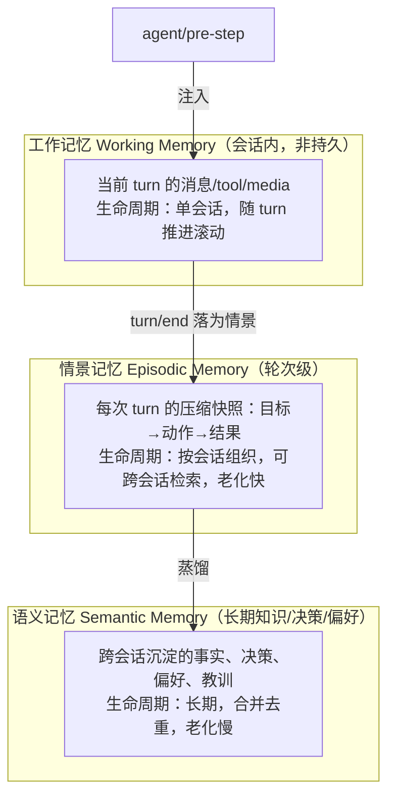
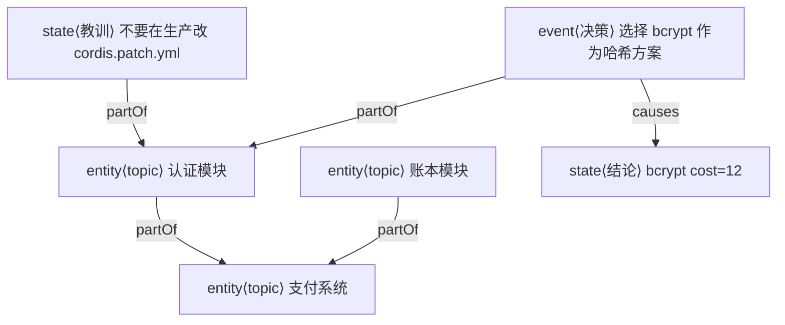
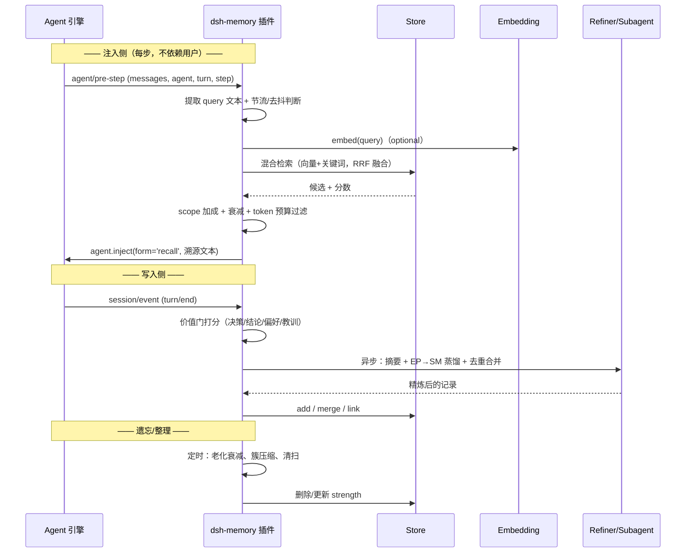

# DSH 自动记忆插件架构方案（memory 进阶设计）

> 目标：从现有单文件 `dsh-auto-memory`（关键词 + 单文件 JSON）演进为一个**分层、可检索、可遗忘、可扩展**的长期记忆子系统，存储底座升级为真正的数据库（SQLite）。
> 核心诉求不变：**无需用户消息触发**，agent 自主工作时每一步都能自动注入与当前任务相关的记忆。

---

## 0. 现状复盘（为什么不够）

现有 `dsh-auto-memory/lib/index.js` 已经验证了闭环，但存在结构性天花板：

| 维度 | 现状 | 缺陷 |
|---|---|---|
| 记忆模型 | 扁平 `{id, content, keywords, source, createdAt}` | 无分层、无元数据、无强度/优先级 |
| 检索 | 关键词**交集**计数 | 无语义、无法召回「意思相关但用词不同」的内容 |
| 存储 | 单个 JSON 文件，全量读入内存 | 无向量、无事务、无作用域隔离、规模受限（线性扫描）——升级为 SQLite 数据库（§2） |
| 写入 | `turn/end` 无条件沉淀整轮 | 噪音多、不去重、无价值判定、无摘要 |
| 注入 | 每次 `pre-step` 全量遍历 | 无 token 预算、无相关性阈值、注入文本不可溯源 |
| 遗忘 | 仅「条数上限，淘汰最旧」 | 无老化、无合并、无用户控制 |
| 扩展 | 无 seam，存储与逻辑耦合 | 无法换后端、无法与 skills/subagents 联动 |

本方案在**保留现有触发点（`agent/pre-step`、`session/event`、`agent.inject` `form:'recall'`）**的前提下，重构内部结构。

---

## 1. 分层记忆架构



### 1.1 三层定义与生命周期

| 层 | 存储 | 生命周期 | 写入触发 | 消费方 |
|---|---|---|---|---|
| **工作记忆 WM** | 内存 only（不落盘） | 单会话 | 每步实时 | 检索时构造 query 上下文 |
| **情景记忆 EP** | 持久（按 session 分区） | 随会话留存，可设置 TTL 或按遗忘曲线衰减 | `turn/end`（带价值判定） | `pre-step` 注入、语义提取原料 |
| **语义记忆 SM** | 持久（全局/项目作用域） | 长期，合并去重 | `EP 蒸馏`（LLM/规则）+ 用户主动记 | `pre-step` 注入、跨会话知识 |

**关键区分**：WM 严格内存化，避免把「正在进行的临时状态」污染到长期库；EP 是情境快照，SM 是去情境化、泛化的结论。这天然形成「用量随衰减」的两级持久梯度。

---

## 2. 存储层

> 本节描述记忆**条目 + 图谱**共享的持久化底座——一个真正的数据库，替代现状的单文件 JSON。图谱的节点/边/社区如何在库内落地见 §6.6；条目与图共用同一库、同一事务、同一检索层，不再各存一份。
> **存储基线定案：嵌入式 SQLite（`node:sqlite`），单库双区（条目区 + 图区），FTS5 关键词 + `sqlite-vec` 向量 + 邻接表图三合一。** 这是针对「Windows + Node 24 + 离线优先」约束的**主选**；备选见 §2.2。

### 2.1 目标与约束

- **Windows + 离线可用**：不依赖任何在线 embedding API（无法访问外网必须能跑）；也不要依赖需联网下载的原生二进制。
- **零原生编译**：选型必须避免 `node-gyp`/prebuild 下载失败这一 Windows 头号坑——优先走 Node 内置或官方预编译产物。
- **本地混合检索**：需支持「向量 + 关键词（FTS5）+ 图邻接」三条路径在同一查询里协同。
- **真事务 + 并发安全**：多 agent/多会话并发写不再靠整文件重写兜底。
- **规模可控**：万级记忆 + 万级节点/边不线性退化。
- **可替换**：通过 seam 抽象，后端可换（但 SQLite 是默认基线，不是临时兜底）。

### 2.2 后端选型与推荐

在 **Windows `win32-x64` + Node `v24.9` + 离线优先**约束下逐项打分：

| 候选 | 全文 | 向量 | 图 | 原生二进制可得性（Windows） | 离线/嵌入 | 依赖体积 | 结论 |
|---|---|---|---|---|---|---|---|
| **SQLite（`node:sqlite`）** | ✅ FTS5（内置） | ✅ `sqlite-vec` 扩展 | ✅ 邻接表（或 `sqlite-lembed`） | ✅ Node 内置，零下载零编译 | ✅ | 极小（核心零依赖） | **主选** |
| better-sqlite3 | ✅ FTS5 | 需另挂扩展 | 邻接表 | ⚠️ prebuild 需下载 / 回退 node-gyp 编译 | ✅ | 中 | 备选（仅当需同步 API 之便） |
| **KuzuDB** | 部分（无成熟 FTS） | ✅ HNSW 向量索引 | ✅ 原生属性图 + Cypher | ⚠️ 预编译 Node 绑定（有 win32-x64） | ✅（嵌入式） | 大 | 进阶备选 |
| LanceDB | 自带全文（`tantivy`） | ✅ ANN（原生） | 无（靠 schema 模拟） | ⚠️ native（`liblance`）下载 | ✅ | 大 | 完备备选 |
| DuckDB + VSS | 无内置 FTS（有 sqlite 兼容） | ✅ VSS（HNSW） | 靠关系表模拟 | ⚠️ 需下载 native | ✅ | 较大 | 完备备选 |
| libsql（`@libsql/client`） | ✅ FTS5 | 扩展受限 | 邻接表 | ⚠️ 远程/本地两套；本地仍回落到 libsql-native | 半在线 | 中 | 不选（离线为王，收益不匹配） |

**主选：SQLite（`node:sqlite`）**。理由：

1. **零原生风险**：Node `v24.9` 的 `node:sqlite`（`DatabaseSync`）是**内置**能力——无 prebuild 下载、无 `node-gyp`、无 ABI 对齐问题，天然绕开「Windows 原生模块编译/下载」这第一大风险（§14 已实证）。当前 DSH 仓库里 `session-persistence-sqlite`、`session-query-sqlite`、`storage-sqlite` 三个包已在生产路径上用同一 `node:sqlite`，生态完全契合。
2. **三合一程度最高**：FTS5 关键词、`sqlite-vec` 向量 ANN、邻接表图三者**同库同事务**，混合检索 RRF 可纯 SQL 完成（§2.5），无需跨进程拼接多引擎结果。
3. **离线 + 嵌入**：单文件、纯本地、无服务端；`.db` 可直接备份/复制。
4. **DSH 生态匹配**：`session-query-sqlite` 已证明 FTS5 在本仓库可用；但注意 `ctx.storage`（`dsh-storage-sqlite`）是**文档 KV 后端，不含 FTS/向量/关系查询**，不能直接复用（见 §2.9 的取舍），本插件持有**自己的** SQLite 库文件，仅借用其打开序列约定。

**备选（阶段性可换，不阻塞主路径）**：

- **KuzuDB**：当「关系遍历」权重超过「混合检索」、且需要 Cypher 表达复杂路径/递归查询时升级——它是真正的嵌入式属性图库，Leiden/Louvain、k-hop、路径都能更优雅地表达（§6.6 保留其对照）。代价：原生绑定 + 体积，向量/全文能力弱，需要与 FTS5/向量侧拼装。用户机器已有 `test_kuzu_db2`/`test_kuzu_db3`，但那是**实验目录**，不构成生产基线依据；本方案将其列为**图区可选的第二后端**，而非存储主基线。
- **LanceDB**：当向量规模达**十万级**、ANN 精度/吞吐成为瓶颈时，作为向量区独立后端；但它的全文（tantivy）与图能力都不足，会让「单库三合一」退化为「三引擎拼装」，故不作为基线。

**结论**：SQLite 为主选一以贯之到完备阶段（规模上限内），KuzuDB 为图区的进阶备选，LanceDB 为向量区的进阶备选——两者都是**可选后端的升级通道**，不再出现在「推荐路径」的必经阶段里。

**Embedding 选择（本地、离线、Windows）**：

| 方案 | 说明 | 优点 | 代价 |
|---|---|---|---|
| **纯本地 ONNX 小模型**（如 `bge-small-zh` 量化版，经 `onnxruntime-node`） | 完全离线 | 无外网、隐私 | 首次下载模型、CPU 推理 |
| **规则 + 关键词兜底（零 embedding）** | 中文 bigram + 英文词 + 同义映射 | 零依赖、纯本地 | 语义召回弱 |
| **可选远程适配器** | 通过 seam 注入 `ctx/*` 的 embedding provider（可调外部 API） | 质量最高 | 需外网 |

方案采用 **Embedding Seam**：默认走「关键词 + bigram」规则引擎（离线可用），当配置了 `embedding.provider`（本地 ONNX 或远程）时自动升级为向量检索——**向量列`memvec`仅在 provider 存在时写入**，`rule` 模式下降级为纯 FTS5。这样既不牺牲离线可用性，又保留升级通道；`α`（§2.5）在无向量时自动归 0。

### 2.3 Schema：单库双区结构与表清单

一个 SQLite 文件 `~/.dsh/memory/memory.db`（WAL 模式），`PRAGMA user_version = 1`，内部分「条目区 + 图区」两大块，共用 `id` 命名空间与统一事务：

```sql
-- ============ 条目区（对应 §9 MemoryRecord） ============
CREATE TABLE memories (               -- 记忆基表：三层用 layer 区分
  id          TEXT PRIMARY KEY,       -- mem-<uuid>
  layer       TEXT NOT NULL,          -- 'episodic' | 'semantic'
  type        TEXT NOT NULL,          -- fact|decision|conclusion|preference|lesson|note
  scope       TEXT NOT NULL,          -- JSON：{sessionId?,repo?,domain?,global}
  content     TEXT NOT NULL,          -- 摘要后正文
  raw         TEXT,                   -- 原文（可裁剪保留）
  keywords    TEXT NOT NULL,          -- JSON 数组（倒排关键词）
  strength    REAL NOT NULL DEFAULT 1,
  occurrences INTEGER NOT NULL DEFAULT 1,
  created_at  INTEGER NOT NULL,       -- epoch ms
  updated_at  INTEGER NOT NULL,
  last_access INTEGER NOT NULL,
  ttl         INTEGER,                -- 可选过期（NULL = 不自动过期）
  source      TEXT NOT NULL           -- JSON：{kind,plugin?,turn?}
) STRICT;

CREATE TABLE memory_vectors (         -- 向量列，独立表：解耦 embedding 生命周期
  record_id   TEXT PRIMARY KEY REFERENCES memories(id) ON DELETE CASCADE,
  vec         BLOB NOT NULL,          -- float32 小端，dim 固定（默认 384）
  dim         INTEGER NOT NULL
) STRICT;

CREATE TABLE memory_versions (        -- 记忆版本（时间维度/世界线，§17）
  id           TEXT PRIMARY KEY,      -- ver-<uuid>
  memory_id    TEXT NOT NULL REFERENCES memories(id) ON DELETE CASCADE,
  revision     INTEGER NOT NULL,      -- 世界线内单调递增 1..N
  content      TEXT NOT NULL,         -- 该版本正文快照
  keywords     TEXT NOT NULL,         -- JSON 数组（该版本关键词快照）
  vec          BLOB,                  -- 该版本向量快照（rule 模式为 NULL）
  valid_from   INTEGER NOT NULL,      -- epoch ms
  valid_to     INTEGER,               -- epoch ms；NULL = 活跃（当前切片）
  superseded_by INTEGER,              -- 被哪个 revision 取代（回滚链）
  created_at   INTEGER NOT NULL,
  source       TEXT NOT NULL,         -- JSON：{kind,plugin?,turn?}
  UNIQUE (memory_id, revision)
) STRICT;
CREATE INDEX idx_versions_memory_rev ON memory_versions(memory_id, revision);
CREATE INDEX idx_versions_active      ON memory_versions(memory_id) WHERE valid_to IS NULL;  -- 活跃切片直查

CREATE VIRTUAL TABLE memories_fts USING fts5(   -- FTS5 倒排虚拟表（"真正数据库"的关键词索引）
  content,                          -- 全文 = content + raw
  keywords,                         -- 关键词辅助列
  content='',                        -- contentless：只存索引，正文回源 memories
  tokenize='unicode61 remove_diacritics 2'
);

-- 常用过滤索引（检索路径见 §2.6）
CREATE INDEX idx_memories_layer_type ON memories(layer, type);
CREATE INDEX idx_memories_scope ON memories(scope);              -- JSON 路径查询兜底
CREATE INDEX idx_memories_created ON memories(created_at);
CREATE INDEX idx_memories_last_access ON memories(last_access);

-- ============ 图区（对应 §6 GraphNode/GraphEdge/Community） ============
CREATE TABLE nodes (
  id            TEXT PRIMARY KEY,    -- mem-<uuid>（与 MemoryRecord 同源）或 node-<uuid>
  kind          TEXT NOT NULL,       -- 'entity' | 'event' | 'state'
  entity_role   TEXT,                -- entity 细分：topic|project|file|person|tech|repo|service
  title         TEXT NOT NULL,
  content       TEXT,
  record_id     TEXT,                -- 关联 MemoryRecord.id（投影）
  scope         TEXT NOT NULL,       -- JSON
  born_at       INTEGER NOT NULL,
  last_active_at INTEGER NOT NULL,
  merged_into   TEXT,                -- 墓碑：指向幸存节点
  strength      REAL NOT NULL DEFAULT 1,
  access_count  INTEGER NOT NULL DEFAULT 0,
  properties    TEXT NOT NULL DEFAULT '{}'  -- JSON
) STRICT;
CREATE INDEX idx_nodes_kind ON nodes(kind);
CREATE INDEX idx_nodes_scope ON nodes(scope);
CREATE INDEX idx_nodes_merged_into ON nodes(merged_into);
CREATE INDEX idx_nodes_last_active ON nodes(last_active_at);

CREATE TABLE edges (
  id          TEXT PRIMARY KEY,      -- e-<uuid>
  from_node   TEXT NOT NULL REFERENCES nodes(id) ON DELETE CASCADE,
  to_node     TEXT NOT NULL REFERENCES nodes(id) ON DELETE CASCADE,
  type        TEXT NOT NULL,         -- EdgeType：mentions|causes|partOf|similarTo|before|solves|supports|contradicts
  weight      REAL NOT NULL DEFAULT 1,
  confidence  REAL,                  -- 抽取置信度（规则=1，LLM<1）
  relation    TEXT,                  -- 自由文本关系说明
  scope       TEXT NOT NULL,         -- JSON
  created_at  INTEGER NOT NULL,
  updated_at  INTEGER NOT NULL,
  source      TEXT NOT NULL          -- 'rule'|'llm'|'manual'|'dsh-event'
) STRICT;
CREATE INDEX idx_edges_from ON edges(from_node);
CREATE INDEX idx_edges_to   ON edges(to_node);
CREATE INDEX idx_edges_type ON edges(type);
-- 无向投影（Leiden 等聚类用）由 SQL 侧 UNION 双向视图完成，见 §6.6

CREATE TABLE node_timeline (         -- 节点时间线（§6.4）
  id        INTEGER PRIMARY KEY AUTOINCREMENT,
  node_id   TEXT NOT NULL REFERENCES nodes(id) ON DELETE CASCADE,
  at        INTEGER NOT NULL,
  op        TEXT NOT NULL,           -- born|activate|merge|typed|relinked
  by        TEXT,
  note      TEXT
) STRICT;
CREATE INDEX idx_timeline_node ON node_timeline(node_id, at);

CREATE TABLE communities (           -- Leiden 聚类结果（§6.5.3）
  id        TEXT PRIMARY KEY,        -- c-<uuid>
  label     TEXT NOT NULL,           -- heuristicLabel
  centroid  TEXT,                    -- 中心节点 id
  cohesion  REAL NOT NULL,           -- 0..1 模块度贡献
  keywords  TEXT NOT NULL DEFAULT '[]',  -- JSON
  updated_at INTEGER NOT NULL
) STRICT;
CREATE TABLE community_members (     -- 社区成员（多对多）
  community_id TEXT NOT NULL REFERENCES communities(id) ON DELETE CASCADE,
  node_id      TEXT NOT NULL REFERENCES nodes(id) ON DELETE CASCADE,
  PRIMARY KEY (community_id, node_id)
) STRICT;
CREATE INDEX idx_community_members_node ON community_members(node_id);

-- 无向量扩展时的占位（§2.7）：sqlite-vec 创建 vec0 虚拟表而非此表
-- 详见 §2.7 的 loadable extension 分支
```

**设计要点**：

- **STRICT 表 + 显式类型**：所有列类型强约束，避免 JSON 文件时代「字段丢失/类型漂移」的静默腐坏。
- **`scope` 存 JSON 列**：作用域过滤用 `json_extract`/`LIKE` 命中 `sessionId`/`repo`/`domain`/`global`（见 §2.6 查询计划）；规模增长后可自建生成别名列（`scope_repo`/`scope_session` 等）换取走索引的等值过滤。
- **向量单独成表**（`memory_vectors`）：embedding 生命周期（provider 上线/下线、换模型维度）与主体对象解耦——无向量时查询完全不触碰该表，`rule` 模式零代价。
- **图区与条目区同库但分表**：`records_id`/`record_id` 建立软关联，图谱是「叠加在记忆上的结构索引」（§6.0 原则），二者可在一个事务里原子更新（写入记忆 + 建节点 + 连边）。

### 2.4 图存储：属性图在 SQLite 的落地

**决策：邻接表（`nodes` + `edges` 两张表），不做原生图库。** 理由与对照见 §6.6；此处给存储层的结论与查询形态：

- **邻接表 vs 原生图库**：图规模在**万级节点/边**时，SQLite 的 `(from_node, to_node)` 双向索引 + 递归 CTE 完全够用，性能达标；原生图库（KuzuDB）的收益（毫秒级深跳、免物化邻接）在万级规模下不显著，且引入原生二进制风险。故**基线用邻接表，KuzuDB 作为图区可选后端留给 §6.6 的进阶项**。
- **k-hop 扩散**（§6.5.1）：递归 CTE 实现，SQL 骨架见 §6.6。一跳走 `idx_edges_from`，逐跳物化 frontier，2~3 跳在万级规模下毫秒级。
- **路径查询**（§6.5.2）：双向 BFS 在应用层（`traverse.js`）用两条 `SELECT edges WHERE ...` 逐层拉取，或单条递归 CTE；有向边方向语义在 §6.2，存储层不区分入/出表，靠 `from_node`/`to_node` 两列 + 双向索引支持任意方向遍历。
- **Leiden 聚类**（§6.5.3）：算法在应用层（纯 JS，参考现有 `traverse.js` 设计）；存储层只提供「无向投影视图」（`similarTo` 双向 + 其余边去向后 `UNION` 双向）供算法读边，结果写回 `communities`/`community_members`。**聚类是离线批量任务**（§7.4 深度管家），不必实时。
- **规模上限**：`maxNodes`（默认 2000，可配扩到万级）、`maxEdges`（默认 8000）由应用层在写入前校验（§6.6），存储层不设硬顶，避免静默截断；淘汰/合并走 §5 遗忘曲线 + §6.6 冷边清理。

### 2.5 混合检索（向量 + FTS5 → RRF）的 SQL 落地

`retriever-default`（§7.1）产出两路候选后，融合在 SQL 层完成，避免把全量结果拉回 JS 再排序：

**关键词路（FTS5）——BM25**：

```sql
SELECT m.id, bm25(memories_fts) AS score
FROM memories_fts
JOIN memories m ON m.id = memories_fts.rowid
WHERE memories_fts MATCH :fts_query          -- 'keyword1 OR keyword2'
ORDER BY bm25(memories_fts)
LIMIT :topK;
```

**向量路（sqlite-vec）——余弦 ANN**：见 §2.7；`sqlite-vec` 提供 KNN 查询，返回 `distance`。

**RRF 融合（纯 SQL，一次查询出最终榜）**——两路子查询各自 `ROW_NUMBER()` 得 `rank`，再按 `1/(k+rank)` 求和：

```sql
WITH kw AS (
  SELECT id, ROW_NUMBER() OVER (ORDER BY bm25(memories_fts)) AS rank
  FROM memories_fts JOIN memories m ON m.id = memories_fts.rowid
  WHERE memories_fts MATCH :fts_query
),
vec AS (
  SELECT id, ROW_NUMBER() OVER (ORDER BY distance) AS rank
  FROM vec_items WHERE vec MATCH :query_vec AND k = :topK   -- sqlite-vec KNN 语法
)
SELECT id,
       COALESCE(1.0/(:rrpk + kw.rank), 0) * (:alpha)
     + COALESCE(1.0/(:rrpk + vec.rank), 0) * (1 - :alpha) AS rrf_score
FROM kw FULL OUTER JOIN vec USING (id)
ORDER BY rrf_score DESC
LIMIT :n;
```

- **`α` 自适应**：`embedding.provider === 'rule'` 时 `α=0`，`vec` 子查询短路，退化为纯 FTS5。
- **融合后重排**：SQL 结果顶多 `topN`（数十条）才回应用层，接 scope 加成 + 衰减 + freshness 的轻量重排（§4.2），开销可忽略。
- **`n` 取两路 topK 的并集去重**，`FULL OUTER JOIN` 保证「单路命中也能进榜」；若某路根本无索引（无向量扩展），则该 CTE 直接省略。

### 2.6 检索路径与查询计划（索引策略）

| 检索路径 | 走的索引 | 查询计划 | 说明 |
|---|---|---|---|
| 关键词召回 | `memories_fts`（FTS5） | MATCH → bm25 → LIMIT | contentless，正文回源 memories |
| 向量召回 | vec 虚拟表（HNSW/暴力） | KNN → distance | 无扩展时短路 |
| 作用域过滤 | `idx_memories_scope`（json_extract）或别名列 | Filter on `scope` JSON | 规模大时升级为生成列走等值索引 |
| 层/类型过滤 | `idx_memories_layer_type` | Seek `layer=? AND type=?` | 复合索引覆盖 |
| 老化扫描 | `idx_memories_last_access` + `idx_memories_created` | 定时 `WHERE last_access < :cutoff` | §5 遗忘曲线批量更新 |
| k-hop 扩散 | `idx_edges_from` / `idx_edges_to` | 逐跳 BFS（应用层）或递归 CTE | §6.5.1 |
| 社区浏览 | `community_members(node_id PK)` | 反查 `community_id` | §6.5.3 |
| 时间线 | `idx_timeline_node(node_id, at)` | range scan | §6.4 演化轨迹 |

**一条典型「注入检索」的执行序列**：`scope` 过滤（等值/JSON）→ `layer/type` 复合 seek → FTS5 MATCH（+ 可选 vec KNN）→ 两路 RRF → `LIMIT n` → 应用层 scope 加成/衰减重排 → 贪心装 token 预算（§4.3）。全程索引友好，无全表扫描。

### 2.7 向量检索：`sqlite-vec` 的选型与加载

- **扩展选择：`sqlite-vec`**（官方 SQLite 向量扩展）：纯 C、无重依赖，提供**预编译 `.dll`**（Windows win32-x64）/ 可本地静态编译，离线可用；支持穷举（精确）与向量索引，KNN 查询语法与上表一致。相比自建「BLOB + 全量 JS 余弦」（原方案进阶项）——那在万级向量下就退化为线性扫描，`sqlite-vec` 的 ANN 让它真正可扩展到十万级。
- **加载方式**：两段式——
  1. `PRAGMA temp.query_only = ...`（不需要）→ 直接 `db.loadExtension(path)`（node:sqlite 支持 `loadExtension`，需编译时未禁用扩展加载；Node 官方二进制默认开启本地加载 ✓）。
  2. 加载失败（缺 `.dll`、扩展禁用）时**优雅降级**：不创建 vec 虚拟表、`α=0`，走纯 FTS5；日志告警一次，不自溃（对齐现状「记忆失败不拖垮宿主」）。
- **写入**：embedding provider 产出 `float32` 向量 → 序列化为小端 BLOB 写入 `memory_vectors`（`rule` 模式下该表空）。
- **备份 `.dll` 于插件目录**，与库文件同版本管理，避免离线时临时下载失败。
- **保留通道**：若采用 KuzuDB 图后端，其 HNSW 向量索引可承接向量区（§6.6）；若采用 LanceDB，则向量区独立。但基线一律 `sqlite-vec`。

### 2.8 可靠性：事务 / WAL / 备份 / 恢复

- **WAL**：`PRAGMA journal_mode = WAL`（默认，对齐 `dsh-storage-sqlite` 的默认值），读写并发（读不阻塞写），频繁小写不整库重写。
- **事务**：写入侧「记条目 + 建节点 + 连边」包一个 `BEGIN IMMEDIATE ... COMMIT`，原子；`PRAGMA foreign_keys = ON` 保证 `CASCADE` 级联删除；`PRAGMA busy_timeout` 设短值（如 2000ms）+ 写失败重试窗口，缓解多 agent 并发写锁（§14）。
- **单进程内并发写**：DSH 插件为单进程；跨会话并发写由 SQLite 的单写者锁机制 + busy_timeout 串行化，无需应用层锁。
- **备份/导出**：
  - 在线备份：`VACUUM INTO`（生成一致性快照副本）；
  - 导出：`SELECT ... -> NDJSON`（逐行）、或 `JSON` 聚合导出整库；
  - 例行：依赖 `VACUUM` + 可选定时快照到 `.db.bak`（§7.4 管家）。
- **损坏恢复**：
  - WAL 崩溃后 SQLite 自动回放/回滚；
  - `PRAGMA integrity_check` 做健康巡检；
  - 极端损坏时：从最近快照恢复 + 重放增量（WAL 若完好），或重建（记忆是「可再生成」的资产，非账本，允许部分损耗）。
  - 对比现状：JSON 文件损坏即「重建、全丢」；SQLite 是页级，损坏常可恢复大部分。
- **与 JSON 文件的本质差异**：JSON 是「整文件原子替换」，任何一次损坏或并发写都牵连全局；SQLite 是「页级 + WAL + 单写者」，把风险降到单页面/单语句。

### 2.9 与 DSH `ctx.storage` seam 的关系（复用 vs 独立）

**结论：不复用 `ctx.storage`（`dsh-storage-sqlite`），本插件持有独立 SQLite 库 + 独立 `ctx.memory.store` seam。** 理由：

| 维度 | `ctx.storage`（dsh-storage-sqlite） | 本插件需 | 取舍 |
|---|---|---|---|
| 数据模型 | 文档 KV：`u_<unit>_<table>(key,value)`，value 是 JSON 文本 | 关系表 + FTS5 虚拟表 + 向量列 + 邻接图 | KV 模型装不进 FTS/向量/图的查询语义 |
| 操作面 | 仅 `loadAll/putRecord/deleteRecord/setGlobal/close` | FTS5 MATCH、KNN、递归 CTE、多表 JOIN | 门面太窄，需下钻 SQL 才能检索 |
| 索引 | 无 FTS、无向量、无自定义索引 | FTS5 + vec + 复合索引 | 后端不暴露建索引入口 |
| 事务粒度 | 单语句原子，无跨记录多表事务保障 | 记忆+节点+边原子写入 | 需自管业务事务 |
| schema 版本 | 拒绝 version-mismatch，无迁移（预发布立场） | 需自己 `user_version` 迁移 | 独立库可控迁移节奏 |
| 适用场景 | 会话性领域数据（workspace 记录等「整取整存」） | 高 churn、按需检索、图/向量结构 | 两者定位不同 |

**复用的部分**：借 `dsh-storage-sqlite` 的**打开序列约定**（`0o600` 建库、WAL、`user_version` 戳记、`STRICT` 表、`PRAGMA foreign_keys`）作为本插件 `store-sqlite.ts` 的打开模板，但物理库文件、schema、连接生命周期、迁移策略全部自持——即「**形式上对齐约定，实质上独立**」。这样既不打破 DSH 的「后端拥有介质、产品包不直接触碰后端」分层原则，也避免把通用 KV 后端硬拗成图+向量引擎。

**seam 结论**：`ctx.memory.store`（§7.1）保持独立，默认 Provider `memory-store-sqlite`（自持 SQLite 库），保留 `memory-store-kuzu`、`memory-store-lancedb` 为可换后端。`ctx.storage` 的 JSON/KV 后端在本方案里**不再作为记忆存储基线**，仅作「导出 JSON 快照」的序列化格式目标（§2.8）。

### 2.10 迁移：存量 `~/.dsh/auto-memory.json` 导入

- **导入路径**：`memory-migrate`（一次性命令 / 首启检测到旧 JSON 文件时自动触发）。
- **字段映射**：

| 旧 JSON 条目 | 新 memories 行 |
|---|---|
| `id` | `id`（原样保留） |
| `content` | `content`（`raw` 留空或同源） |
| `keywords[]` | `keywords`（JSON 列） |
| `source`（`'turn-summary'` 字符串） | `source` 归一为 `{kind:'user', plugin:'dsh-auto-memory'}` + `type='note'`、`layer='episodic'` |
| `createdAt` | `created_at`（`updated_at`/`last_access` 同值） |
| （无） | `scope` 默认 `{global:true}`（无项目信息时全局兜底） |

- **流程**：读旧 JSON → 逐条映射 → **批量事务**写入（一次 `BEGIN` 内 `INSERT`，旧库几千条秒级）→ 重建 FTS5 索引（`INSERT` 时自动填充）→ 迁移后旧文件改名 `auto-memory.json.bak` 归档（不删除，用户可回滚）。
- **向量回填**：迁移时无 embedding provider 则 `memory_vectors` 为空（纯 FTS5）；若配置了 provider，其后台子代理批量回填向量（§7.4），不阻塞迁移。
- **图区回填**：旧数据无图结构，迁移只填条目区；图区由后续 §6.7 的写入建图自然生长（首轮检索无图、后续渐满）。

### 2.11 作用域隔离

记忆条目带 `scope`，检索时按作用域过滤 + 泛化回退（沿用 §2.6 的 scope 过滤路径）：

| scope 字段 | 说明 | 检索优先级 |
|---|---|---|
| `sessionId` | 会话隔离（仅本会话） | 最高匹配 |
| `repo` / `project` | 项目/仓库隔离 | 次高 |
| `domain` | 主题域（可跨项目泛化） | 中 |
| `global` | 全局知识（偏好、通用教训） | 兜底 |

检索策略：**先命中具体作用域，不足则回退到全局**，避免「跨仓库记忆串味」；图区的 `nodes.scope`/`edges.scope` 用同一语义，保证扩散（§6.5.1）不越界。

---

## 3. 写入策略（什么值得记）

> 本节解决「记什么、怎么去重合并」；记忆入图后**如何抽取实体/关系并建边**，详见 §6.7。

### 3.1 价值判定（自动）

在 `turn/end` 阶段，不是无条件沉淀，而是先过「价值门」（score 加权）：

| 信号 | 权重 | 说明 |
|---|---|---|
| 含**决策**表述（"决定/采用/选择…"） | +高 | 决策类最有价值 |
| 含**结论**（"结论/结果/验证通过/修复了…"） | +高 | |
| 含**偏好**（"我更倾向于/不喜欢/习惯…"） | +高 | 语义层长期保留 |
| 含**失败教训**（"踩坑/失败/错误/不要…"） | +高 | |
| 纯闲聊/寒暄/重复 | +0 甚至过滤 | 噪音 |
| 与已有记忆**重复度高** | 触发合并而非新写 | |
| tool/result 含错误堆栈 | +中（教训信号） | |

**实现**：规则打分（默认，离线）→ 可升级为 LLM 判定（配置 `refineModel`）。低于阈值直接丢弃。

### 3.2 去重 / 合并

写入前做**相似性检测**（向量余弦 / 关键词 Jaccard）：

- **近重复**（相似度 > 0.9）：不新增，`merge` 进原条目（更新时间戳 + 强度 `strength` +1，追加 `occurrences`）。
- **高度相关但非重复**（0.6~0.9）：LLM/规则生成一条**上级摘要**，链接两条子记忆（`links: [id...]`），形成「记忆簇」。
- **低相关**：独立新增。

这样避免「同一件事每轮都记一条」。

### 3.3 自动摘要

- **规则摘要**：extract 目标 + 最后结论（延续现状），截断。
- **LLM 摘要（可选）**：`refine` 时把整轮压缩为「做了什么 / 得到什么 / 学到了什么 / 下次注意」四元组，作为语义记忆的原料。LLM 调用通过**子代理异步**执行，不阻塞主 agent 流程（见 §7.4）。

### 3.4 噪音过滤

- 黑名单/停用词、超短文本、纯 UI 抖动、注入内容本身（只索引 `source.kind==='user'`，排除 `form:'recall'`）——延续现状但更严格。
- `maxMemoryBytes` 截断，避免超长工具输出直接入库。

---

## 4. 注入策略

> 本节描述**命中条目后的注入与预算**；命中后如何**沿边扩散**注入邻域记忆与关系说明，详见 §6.9。

### 4.1 时机

| 时机 | 触发点 | 用途 | 频率 |
|---|---|---|---|
| **每步** | `agent/pre-step`（waterfall，主通道） | 相关记忆常驻 | 每步，但带节流 |
| 会话开始 | `agent/session-start` | 预热 seed（用户/项目画像） | 1 次 |
| 关键节点 | `step/end`、`turn/start` | 阶段性补充注入（必要时） | 低频 |
| 收件箱 | `agent/inbox/inserted` | 外部指令到达时补一次检索 | 按需 |

主通道仍为 `pre-step`——这是「不依赖用户消息」的根本保障。为避免每步全量检索的性能/成本，加**节流**：

- **步距节流**：默认每 N 步（如 2~3 步）才全量重检索；中间步复用上次结果。
- **签名去抖**：若当前 query 与上次 query 相似度 > 阈值，跳过重复注入。

### 4.2 相关性评分与防污染

```
score(hit, query) = RRF(向量, 关键词) · scopeBoost · recencyDecay · strengthWeight
```

- **只注入与当前工作相关**：`score >= injectMinScore` 才注入。
- **scopeBoost**：同 session/repo 加分，跨域减分甚至排除。
- **防污染**：`agent.inject` 的消息 `source.form='recall'`、`plugin='dsh-memory'`，模型可溯源；注入内容里**显式标注来源与相关度**。

### 4.3 容量控制（token 预算）

- `预算 = injectMaxTokens`（如 800 token / 次）。
- 每条记忆按字符估算 token，贪心装入直到预算耗尽。
- 总上下文保护：`maxRecentPerAgent` + 全局 `budgetWindow`，避免记忆挤占任务上下文。

### 4.4 注入文本格式（可读、可溯源）

```
[记忆] 与当前工作相关的既有记录（来源：dsh-memory，form=recall）

【结论性记忆】#mem-8f3a  ·  相关度 0.87 ·  2026-08-14
> 「opencode-go provider 使用 opencode.ai/zen/go/v1 端点，key 在 opencode.json」

【教训】#mem-9c12 ·  相关度 0.71 ·  2 周前
> 不要在生产 profile 直接改 cordis.patch.yml，先 dump-config 校验
```

- `#mem-<id>` 提供**溯源锚点**，模型可据此要求「忘掉」或「展开」。
- 分层标记（结论/决策/教训/偏好）让模型知道可信度。

### 4.5 防循环

延续并强化：

- **只索引真实用户消息**（`source.kind==='user'`），注入内容永不被再索引。
- **最近注入窗口**（`maxRecentPerAgent`）内不重复注入同一条。
- **签名去抖**（§4.1）——注入后 query 签名进入窗口，短期不重复。
- **环检测**：若检测到「注入的内容又被模型当作新问题写入」，通过 `source.form==='recall'` 溯源拦截。

---

## 5. 遗忘与压缩

### 5.1 记忆老化（衰减函数）

每条记忆维护 `strength`、`lastAccess`、`createdAt`，用**遗忘曲线**衰减：

```
effectiveStrength = strength · exp(-λ · Δt) · accessBoost
```

- `λ` 按层不同：情景记忆 λ 大（快忘），语义记忆 λ 小。
- **访问加成**：被检索命中并注入则 `strength` +Δ（强化记忆，符合「常用则留」）。

### 5.2 优先级与删除策略

- 低于 `minEffectiveStrength` 的条目进入「濒死区」，可选备份后删除。
- 用户可**显式忘记**（工具 `memory_forget`），优先级最高、不可逆。
- 隐私：支持 `memory_purge` 清空某 scope（会话/项目/全部）。

### 5.3 合并压缩

- 定期（低频后台任务）对「记忆簇」做**压缩**：多子记忆 → 一条语义级摘要，释放 token 与存储。
- 触发：簇内条目数 > 阈值 或 全局条目超上限。

### 5.4 用户可控（工具暴露）

见 §8 的 `memory_*` 工具，遗忘/压缩/清理由用户与模型共同驱动。

---

## 6. 记忆图谱（立体结构）

> 章节定位：前面的分层（§1）、存储（§2）、写入（§3）、注入（§4）解决的是「每一条记忆如何被记录与召回」；本章把记忆之间的**关系**本身建模为一等公民——节点、边、层级、时间线与社区共同构成一张可遍历、可推导、可压缩的**立体记忆图谱**。
> 设计语言借鉴 GitNexus 知识图谱的「节点 → 边 → 社区（Community）」分层思想（`CodeRelation` 统一边表、Leiden 社区检测、Process 流程 trace），但对象从「代码符号」换成「记忆」。

### 6.0 立体化要解决什么问题

现有方案里 `MemoryRecord.links: string[]`（§9）只是「记忆簇」的扁平 id 数组，无法回答：

| 问题 | 扁平列表 | 图谱 |
|---|---|---|
| 「项目 A 的模块 B 为什么改成 C？」 | 需人工拼多条 | 沿 `部分-整体` + `因果` 边一步到达 |
| 「这次失败和上次失败是同一根因吗？」 | 不可判定 | `相似` 边候选合并 + `因果` 溯源 |
| 「关于『登录』我积累了哪些结论？」 | 关键词召回，零散 | 主题子树一次取全 |
| 「X 和 Y 之间有没有关系链？」 | 无 | 路径查询 k 跳 |
| 「这个偏好是 3 个月前哪次教训形成的？」 | 不可追溯 | 事件节点 + 时间线 |

**核心原则**：图谱是**叠加在分层记忆之上**的结构索引，不取代 §9 的数据模型与 §2 的存储，而是给 `MemoryRecord` 增加一层可选的、关联驱动的检索与组织能力。`links` 字段的语义从「簇」泛化为「有类型、有方向的边」。

### 6.1 节点类型（Node Schema）

```ts
// 节点：图谱的顶点，一份是「长期结论」的语义投影，一份是「发生过什么」的情景锚点。
// 与 §9 MemoryRecord 的关系：MemoryRecord 是「条目」，GraphNode 是它的「图谱身份」。
// 一条 MemoryRecord 可以有 0..1 个对应 GraphNode（结构无关的纯条目可不入图）。

type NodeKind =
  | 'entity'      // 实体：主题/项目/文件/人/技术/仓库
  | 'event'       // 事件：一次决策/一次失败/一次修复/一次对话里程碑
  | 'state'       // 状态：偏好/结论/教训/约束/习得的事实

type EntityRole = 'topic' | 'project' | 'file' | 'person' | 'tech' | 'repo' | 'service'

interface GraphNode {
  id: string                  // 图谱内唯一 id（建议 = mem-<uuid>，可与 MemoryRecord.id 同源）
  kind: NodeKind
  entityRole?: EntityRole     // kind==='entity' 时细分角色
  title: string               // 短标题（作为注入/nav 的 label）
  content?: string            // 完整正文（state 节点引用语义记忆；event 节点引用情景快照）
  recordId?: string           // 关联的 MemoryRecord.id（若该节点由条目投影而来）
  scope: {
    sessionId?: string
    repo?: string
    domain?: string
    global: boolean
  }
  // —— 时间维度（§6.4）——
  bornAt: number              // 节点首次出现（= 首次被提及/创建）
  lastActiveAt: number        // 最近一次「被写入/被命中/被连边」时间，驱动活跃度
  mergedInto?: string         // 若被合并，指向幸存节点（墓碑）
  timeline: GraphTimeline     // 演化轨迹（见下）
  // —— 图元数据 ——
  strength: number            // 与 §9 strength 对齐，但按节点维度衰减
  accessCount: number         // 被注入命中的次数（访问加成依据）
  properties: Record<string, unknown>  // 可扩展属性（如文件的 language、技术版本）
}

// 节点时间线：一次「状态变更」就是一条轨迹，构成节点的诞生/活跃/合并历史
interface GraphTimeline {
  born: TimelineEvent                         // 诞生事件
  activations: TimelineEvent[]                // 活跃事件（被写入/命中/连边）
  merges: TimelineEvent[]                     // 合并事件（被谁合并、何时）
}

interface TimelineEvent {
  at: number                 // 时间戳
  op: 'born' | 'activate' | 'merge' | 'typed' | 'relinked'
  by?: string                // 触发源（sessionId / recordId / subagent id）
  note?: string
}
```

### 6.2 边类型与方向语义（Edge Schema）

```ts
// 边：有类型、有方向的关联。方向语义固定，遍历时据此解释。
// 参考 GitNexus 用单一边表（type 字段区分）而非每种边一张表，降低实现成本。

type EdgeType =
  | 'mentions'     // 引用：A 提及 B（弱关联）
  | 'causes'       // 因果：A 导致 B（强定向）
  | 'partOf'       // 部分-整体：child -partOf-> parent（项目→模块→细节，方向朝向整体）
  | 'similarTo'    // 相似：去重/合并候选（对称，但存两个方向或约定单向+双向标记）
  | 'before'       // 时间先后：A 演化到 B / A 先于 B
  | 'solves'       // 贡献：B 解决 A 暴露的问题 / B 修复 A
  | 'supports'     // 佐证：A 支持/印证 B（证据链）
  | 'contradicts'  // 矛盾：A 与 B 冲突（重要——知识过时/翻案的信号）

interface GraphEdge {
  id: string                  // e-<uuid>
  from: string                // 源节点 id
  to: string                  // 目标节点 id（方向 = from → to）
  type: EdgeType
  weight: number              // 0..1，默认 1；相似边 = 相似度，因果边 = 置信度
  confidence?: number         // 抽取置信度（规则=1，LLM 抽取<1）
  relation?: string           // 自由文本关系说明（注入时用「与 X 相关（因果）：…」）
  scope: { sessionId?: string; repo?: string; domain?: string; global: boolean }
  createdAt: number
  updatedAt: number
  source: 'rule' | 'llm' | 'manual' | 'dsh-event'   // 谁建的边（§6.7）
}

// 方向语义速查（遍历展开时统一措辞）
//   A -causes-> B     : "B 由 A 导致"  —— 命中 B 时回溯 A（找根因）
//   A -partOf-> B     : "A 是 B 的一部分" —— 命中 B 时下钻 A（看细节），命中 A 时上溯 B（看全貌）
//   A -before-> B     : "A 之后演进为 B" —— 时间线从 A 走到 B
//   A -solves-> B     : "A 解决了 B 的问题" —— 命中 B（问题）时沿反向找到 A（解法）
//   A -similarTo-> B  : "A 与 B 相似"   —— 去重/合并候选
```

### 6.3 边与层级：主题树如何表示

**决策**：主题层级用**独立于节点树之外的 `partOf` 边**表示，不额外维护 Tree 结构。

- **为什么不建独立 tree**：主题树本质是「部分-整体」的一种特例，用边表达即可复用统一的图遍历、老化、社区逻辑；独立 tree 会带来第二个数据源与同步问题。
- **父子关系 = `partOf` 边**：`模块 -partOf-> 项目`，`细节 -partOf-> 模块`。方向统一「朝整体」，因此 root 主题没有出边 `partOf`（只有入边）。
- **虚拟主题节点**：主题可作为 `entity(topic)` 节点显式存在（携带 title/domain/strength），也可仅在需要时由 `domain` 字段隐式聚合——先用**显式 topic 节点**，保证可遍历、可注入、可命名。
- **与扁平标签的关系**：`MemoryRecord.keywords`（§9）仍是**廉价、无结构的倒排索引**，用于首层向量/关键词召回；图谱的主题层级是**结构化补充**，用于召回之后的「沿边扩张」。二者分工：**标签负责『快』，层次负责『全』**。标签不必强制同步进图谱，避免双写负担。



### 6.4 时间维度：节点轨迹与事件序

- **节点三种时间命运**（对应 `GraphTimeline`）：
  - **诞生 born**：实体首次被提及 / 事件发生时创建节点，`bornAt` 落定。
  - **活跃 activate**：被写入、被检索命中注入、被连新边，`lastActiveAt` 刷新、`accessCount++`；用于 §5 遗忘曲线的「访问加成」。
  - **合并 merge**：与另一节点 `similarTo` 且超阈值后合并，本节点打墓碑 `mergedInto`，边重定向到幸存节点。
- **事件节点的线性时间序**：`event` 节点之间用 `before` 边连成**演化链**（`决策1 -before-> 决策2`），可回答「这个偏好/结论是经过哪些决策逐步形成的」。`before` 边在写入时按 `bornAt` 单调推断，是唯一「确定性大于语义性」的边。
- **时间线注入价值**：命中一个节点时，可附一句「该结论首次出现于 <date>，后由 <event> 修正」（沿 `before`/`causes` 回溯），让模型判断知识是否过时（配合 §6.2 的 `contradicts` 边）。

### 6.5 图上的操作

#### 6.5.1 邻域扩散检索（k-hop）

命中节点后，沿边有界扩散，取 k 跳内的邻域：

```
expand(seeds, k, budget):
  frontier = seeds
  for hop in 1..k:
    next = ∪ { neighbors(frontier) }                       # 沿边 BFS
    next  = next.filter(|node| scopeMatch(node, query))    # 作用域过滤（§2.4）
    next  = next.filter(|node| strength(node) >= floor)    # 衰减过滤
    frontier = next
  返回按「边类型加权 + 跳数衰减」排序的节点集合
```

- **跳数衰减**：`score(node) ∝ weight(edge) · γ^hop`（γ≈0.5），一跳邻居最重。
- **边类型优先级**：`causes`/`partOf`/`solves` > `before`/`supports` > `mentions`（语义强的边优先扩散）。
- **k 默认 2**，最多 3；配合 §6.9 的 token 预算，先深后广或先广后深可配。

#### 6.5.2 路径查询（A→B 关系链）

给定两个节点，求关系链（BFS/双向 BFS，有向）：

- 返回 `A -mentions-> M -causes-> B` 这样的**边序列**，注入时展开为自然语言：「A 提到 M，M 导致 B」。
- 用途：模型自问「这两个记忆怎么连起来的？」、去重时判断「是否本就同源」、解释「为什么这条记忆可信」。

#### 6.5.3 社区聚类（自动成簇）

- **算法**：Leiden / Louvain 在无向投影图上跑（`similarTo` 视为双边，其余取去向后聚合），得到 `Community`。
- **社区命名**：取簇内度数最高节点的 title 或 LLM 摘要一句话作为 `heuristicLabel`（沿用 GitNexus 的命名习惯）。
- **用途**：`memory_list` 按社区分组浏览；`社区代表记忆` 作为图摘要的种子；跨 repo 但同社区的节点可当作「可泛化知识」的候选。

```ts
interface Community {
  id: string
  label: string               // 代表性命名（如「登录鉴权」「依赖升级事故」）
  members: string[]           // 节点 id
  centroid: string            // 中心节点 id（代表）
  cohesion: number            // 0..1，模块度贡献
  keywords: string[]          // 簇内高频词，用于首层召回匹配
}
```

#### 6.5.4 图谱摘要（簇代表性记忆）

- 对一个 Community / 一棵主题子树，产出**代表性记忆**：中心节点全文 + 邻域精简（一跳邻居 title + 边类型），作为 §6.9 注入时的「簇摘要」而非逐条铺开，省 token。
- 触发：注入命中某簇且簇成员数 > 阈值时，注入 `clusterSummary` 而非展开全部成员（与 §5.3 的簇压缩共享逻辑）。

### 6.6 存储：属性图在 SQLite 上的落地

**定位**：图谱存储与 §2 的条目存储**同库、同事务、同一 `ctx.memory.store` seam**——不再像当初「内存图序列化到独立 `graph.json`」那样另起一份文件。「条目区 + 图区」双区并存于 `~/.dsh/memory/memory.db`（§2.3），图谱是**叠加在条目之上的结构索引**（§6.0 原则的物理落地）。

| 方案 | 结构 | 优点 | 缺点 | 建议 |
|---|---|---|---|---|
| **SQLite 邻接表** | `nodes(id,kind,...,props JSON)` + `edges(from,to,type,...)` 两表 | 事务、可索引、规模大、与条目/向量同库 | 深跳遍历需递归 CTE | **主选（基线）** |
| **KuzuDB（原生属性图）** | Cypher 图 + 内置 HNSW 向量 | 深跳毫秒级、聚类/路径表达优雅 | 原生绑定 + 体积、FTS 弱、需拼装 | 图区进阶备选 |
| **LanceDB / DuckDB 图表** | 关系表模拟图 + 向量 ANN | 向量规模上限最高 | 图能力弱、多引擎拼装 | 向量区进阶备选 |

- **邻接表落地细节**（SQL 模式见 §2.3 图区 DDL）：
  - **遍历方向**：靠 `from_node`/`to_node` 两列 + `idx_edges_from`/`idx_edges_to` 双向索引支持任意方向；`partOf`/`causes` 等方向语义在 §6.2 解释，存储层不区分入/出表。
  - **k-hop 扩散**（§6.5.1）用**递归 CTE** 或应用层逐层 BFS：

    ```sql
    WITH RECURSIVE hop(nid, h, w) AS (
      SELECT :seed, 0, 1.0
      UNION ALL
      SELECT e.to_node, hop.h + 1, hop.w * e.weight * :gamma
      FROM edges e JOIN hop ON e.from_node = hop.nid
      WHERE hop.h < :k
    )
    SELECT n.id, n.title, n.kind, MIN(hop.w) AS score
    FROM hop JOIN nodes n ON n.id = hop.nid
    GROUP BY n.id ORDER BY score DESC;
    ```

    万级节点/边、k≤3 时毫秒级；`gamma` 跳数衰减与 §6.5.1 一致。
  - **路径查询**（§6.5.2）：双向 BFS 用两条 `SELECT` 逐层拉邻接，或递归 CTE 单向 DFS 记路径边序列；有向边方向在遍历中判定 forward/backward。
  - **Leiden 聚类**（§6.5.3）：算法在 `traverse.js` 纯 JS 跑；存储层提供**无向投影**读边——`similarTo` 视为双向，其余边 `UNION` 去向后双向展开——结果写回 `communities`/`community_members`。聚类是 §7.4 管家的离线批量任务，不抢实时检索。
  - **向量承接**：图区节点若需向量（§6.5.3 社区代表匹配），复用 §2.7 的 `sqlite-vec`；换 KuzuDB 后端时由其 HNSW 索引承接。
- **与既有 seam 的关系**：`ctx.memory.graph` seam（接口见 §6.11）默认 Provider `graph-sqlite`（读写在 §2.3 图区），复用 §2 的库连接/事务/scope 约定；不再有 `graph-memory`（内存图 + 独立 JSON 文件）这一层——因为图与条目同库后，「内存图序列化」既无必要又引入双写。内存态仅保留**瞬时的 WM 子图**（§6.13，会话级、不落盘）。
- **规模控制**：
  - **上限**：`maxNodes`（默认 2000，可配扩到万级）、`maxEdges`（默认 8000，平均度数 ≤ 4）由应用层写入前校验，不做硬性静默截断。
  - **老化**：与 §5 遗忘曲线联动——节点 `strength` 衰减到 `minEffectiveStrength` 且有墓碑/孤立时下线（`DELETE` 节点，`ON DELETE CASCADE` 级联删边与时间线；`record_id` 指向的条目保留可回滚）。
  - **边淘汰**：`mentions` 弱边最先冷边清理；`causes`/`partOf` 保留更久（§6.2 优先级）。
  - **合并压缩**：`similarTo` 候选在后台子代理批量合并（§7.4），边重定向到幸存节点（`merged_into` 墓碑 + 边 UPDATE），降低节点数。

### 6.7 写入侧建图：新记忆如何入图

写入入口是 §3 的价值门之后的「候选记忆」。建图分两层：

**第一层：规则抽取（默认，同步、离线）**

- **实体**：正则 + 关键词命中已知实体表（项目名、文件名、技术栈）+ scope 推断（repo/domain 直接映射为 entity 节点的域）。
- **关系**：
  - 同一轮 `turn/end` 内出现的实体两两连 `mentions` 边（弱）。
  - 命中决策/结论/教训关键词（§3.1）时，连 `causes`（决策→其产出的结论）/ `solves`（修复→失败）。
  - 新记忆与既有条目 Jaccard/余弦相似 > 阈值时连 `similarTo`（借用 §3.2 的去重信号）。
- **主题挂载**：按 scope.domain 找到 `partOf` 父主题；无则新建 topic 节点。

**第二层：LLM 异步抽取（可选，配 `refineAsync`）**

- 把整轮委派给子代理（§7.4），对实体/关系做**结构化抽取**（`{entities[], relations[]}`），产出 `confidence` 更准的边（含 `relation` 自然语言、`causes` vs `supports` 的细化）。
- 结果与规则边**去重融合**（同 from/to/type 时取高 confidence、保留双向）。

**归并策略（何时新建节点、何时挂到已有节点）**：

```
incoming(record):
  entities = extract(record)          # 规则或 LLM
  for e in entities:
    existing = resolve(e)             # 按 title+role+scope 精确/模糊匹配已有节点
    if existing:
      if e 是「同一实体」  -> 复用节点，activate(existing)，必要时重写 title/properties
      else if e 与 existing 相似超阈值 -> 连 similarTo 候选，交后台合并
    else:
      node = create(e)                # 新建节点
  for (e1,e2) in entities: 连 mentions（若语义更强则 causes/solves）
  挂 partOf（scope.domain → topic 节点）
```

- **归一化**：title 归一（小写、去空格、同义映射）后再 resolve，避免「用户画像 / 用户profile」两个节点。

### 6.8 注入侧用图：命中后沿边扩散

在 §4 的「命中条目 → 渲染注入」之间插入图谱扩散（§6.5.1）：

```
命中 seeds（§4 RRF 结果）
  ↓
expand(seeds, k=2, budget)            # 邻域扩散，取 k 跳
  ↓
按边类型分组渲染（§6.9 格式）
  ↓
丢进 §4.3 的 token 预算贪心装入
```

- **深度控制**：`graphHop`（默认 1~2）；深度越大，token 越贵、越易跑偏，故默认浅扩散。
- **Token 预算**：扩散结果**不单独超支**，统一进 §4.3 的 `injectMaxTokens`；图节点只注入 `title`（长文用 §6.5.4 的簇摘要替代），保证邻域信息「便宜」。
- **关系说明**：注入文本显式标注边，如「与 X 相关（因果）：B 由 A 导致」，让模型**知道为什么**这条记忆出现，而非黑盒召回。

### 6.9 注入文本格式（带关系说明）

在 §4.4 的扁平列表之上，增强为**图感知**的格式：

```
[记忆] 与当前工作相关的既有记录（来源：dsh-memory，form=recall）

【结论性记忆】#mem-8f3a · 相关度 0.87 · 2026-08-14
> 「opencode-go provider 使用 opencode.ai/zen/go/v1 端点，key 在 opencode.json」
   ↳ 相关（部分-整体）：属于 #node-proj「opencode 接入」
   ↳ 相关（因果）：由 #node-event「接入 opencode-go provider」导致

【邻域·1 跳】#node-event「接入 opencode-go provider」 (#mem-9c12)
> 决策：选择 opencode-go 作为 provider（相关度 0.63）
```

- `#node-*` 提供**图节点锚点**，模型可据此 `memory_graph_neighbors` 主动下钻。
- 仅当 `graphHop > 0` 且命中节点有邻域时才展开「邻域」段，未启用图谱时回退 §4.4 原文。

### 6.10 工具面：memory_graph_* 工具

在 §8 的 `memory_*` 之上，新增图谱专用工具（默认不开或按需开）：

| 工具 | 动作 | 用途 |
|---|---|---|
| `memory_graph_neighbors` | 查某节点/记忆的 k 跳邻居（按边类型过滤） | 主动下钻邻域 |
| `memory_graph_path` | 查 A→B 的关系链（返回边序列） | 溯源两点关联 |
| `memory_graph_communities` | 列出社区 / 看某社区成员与代表 | 浏览成簇知识 |
| `memory_graph_link` | 手动连一条边（from/to/type） | 人工纠图 |
| `memory_graph_unlink` | 删一条边 | 纠错 |
| `memory_graph_node` | 看某节点详情（属性 + 时间线 + 度数） | 审查入口 |

- 分工延续 §8：自动扩散负责**默认可用的邻域回忆**，图工具负责**精确的图查询与人工修图**。

### 6.11 Seam 与目录扩展

在 §7.1 的 seam 清单上**新增**：

| Seam | 职责 | 默认实现 |
|---|---|---|
| `ctx.memory.graph` | 图谱门面（`addNode/addEdge/neighbors/path/communities/summary`） | `graph-sqlite`（读写在 §2.3 图区） |
| `ctx.memory.graph.extractor` | 实体/关系抽取（`extract(record) → {entities,relations}`） | `extractor-rule` / `extractor-llm`（经子代理） |

目录增补（见 §12）：

```
lib/
├── graph/
│   ├── node.js            # GraphNode/GraphTimeline 构造与归一化
│   ├── edge.js            # GraphEdge 类型/方向语义/权重
│   ├── index.js           # 图门面（读写 §2.3 图区：邻接表 + 递归 CTE 遍历）
│   ├── traverse.js        # k-hop 扩散 / 路径查询 / 社区检测
│   ├── extractor.js       # 规则抽取 + LLM 抽取融合
│   └── summary.js         # 簇代表性记忆 / 图摘要
└── provider/
    └── graph-sqlite.js     # Provider: SQLite 图区（基线）
```

### 6.12 与 DSH 的结合：由会话事件自然建边

利用 DSH 既有的会话事件（tool/result、todo/write、session/event）驱动建图——**不依赖语义抽取，先靠「共现」与「动作关联」自然成图**：

| DSH 事件 | 建图动作 | 形成的边 |
|---|---|---|
| `session/event`（turn/end，含 tool/result 序列） | 同一 turn 内出现的实体两两互连 | `mentions`（共现） |
| `tool/result`（错误堆栈 / 修复回归通过） | 失败 → 后续修复 | `causes` / `solves` |
| `todo/write`（todo 完成） | todo 项 ↔ 其产出物/决策 | `partOf`（任务→子任务）、`solves`（完成↔问题） |
| `session/event`（同一 topic 跨 turn 复发） | 强化既有边 `weight`、`activate` 节点 | 边加固 |
| `tool/result`（文件读写） | 文件实体 ↔ 项目主题 | `partOf` |

- **`todo/write` → 决策关联**：一个 todo 被勾选完成，往往对应「某个决策落地」——把 todo 与当轮产出的 `decision`/`conclusion` 节点用 `solves`/`causes` 关联，形成「任务 → 决策 → 结果」链路。
- **同一 turn 共现互连**（核心自动边）：即使无 LLM 抽取，只要实体在同一个 turn 出现，就先连弱 `mentions` 边；后续语义抽取（§6.7 第二层）异步升级为强边。这样图「先能长出来，再慢慢变精确」，完全复用 GitNexus「先建索引、后精化」的思路。
- **与 GitNexus 对齐**：GitNexus 的 `CodeRelation`（单边表 type 区分）+ `Community`（Leiden）+ `Process`（trace）三件套，正好映射到本方案的 `GraphEdge.type` + `Community` + §6.4 时间线/§6.5.2 路径查询。

### 6.13 三层记忆到图谱的映射

| 分层（§1） | 图谱映射 | 说明 |
|---|---|---|
| **工作记忆 WM** | 临时子图（内存，不落盘） | 当前 turn 的实体/事件先形成「瞬时图」，turn/end 时决定哪些节点/边升入持久图 |
| **情景记忆 EP** | `event` 节点为主 | 每次 turn 快照 = 一个 `event` 节点；EP 的 `sessionId` 分区 = 沿 `before` 边串起的事件时间线 |
| **语义记忆 SM** | `state` 节点 + `entity(topic)` 子图 | SM 是「去情境化结论」，对应图里的长期子图（`state` 节点挂到 `entity` 主题下经 `partOf` 组织） |

**蒸馏关系**（结合 §3.3）：EP（多个 event）→ 蒸馏 → 一条 SM（state 节点），用 `before`/`causes` 边把「来源事件」连到「泛化结论」，图谱即可回答「这个结论由哪些经历支撑」。

### 6.14 实施节奏（并入 §13 路线图）

- **阶段一（数据库基线）**：SQLite 图区（邻接表）落地；规则抽取建 `mentions`/`partOf`/`similarTo` 边；`neighbors`/`path` 工具（递归 CTE）；并入 `memory_graph` seam。
- **阶段二（进阶）**：`sqlite-vec` 向量 + 图联合检索；LLM 异步抽取（`extractor-llm`）；Leiden 社区检测 + 图摘要注入；`before`/`causes` 时间线。
- **阶段三（完备）**：图区可选切换 KuzuDB（原生属性图，规模驱动）；`contradicts` 矛盾检测（知识过时/翻案）；`memory_graph_*` 全量工具 + 深度管家自动修图。

---

## 7. 扩展性：Seam 设计（Service + Provider + Consumer）

DSH 一切皆插件、Cordis 驱动，`ctx.*` 有 56 个可插拔 seam。本插件**消费现有 seam 并提供新 seam**。

### 7.1 提供的新 Seam

| Seam | 职责 | 默认实现 |
|---|---|---|
| `ctx.memory` | 记忆服务的**门面**（`add/search/forget/merge/stats`） | 本插件 |
| `ctx.memory.store` | 存储后端（`put/get/delete/search/scan`） | `memory-store-sqlite`（基线）/ `memory-store-kuzu` / `memory-store-lancedb` |
| `ctx.memory.embedding` | 向量化（`embed(texts) → vectors`） | `embedding-rule`（默认，兜底）/ `embedding-onnx` / `embedding-remote` |
| `ctx.memory.refiner` | 摘要/价值判定（`refine(record) → summary`） | `refiner-rule` / `refiner-llm` |
| `ctx.memory.retriever` | 混检 + RRF + 重排策略 | `retriever-default` |

### 7.2 三件套模式

每个 seam 满足 DSH 的 **Service Definition + Provider + Consumer** 三件套：

```
Service Definition（接口/类型）
   └── Provider（xxx implements Service，可替换，通过 cordis 注入）
         └── Consumer（ctx.memory 消费 Provider，业务逻辑不变）
```

**效果**：换后端、换 embedding、换 refiner，不改业务逻辑，只换 Provider。用户可写自己的 `memory-store-xxx` 插件注册进 `ctx.memory.store`。

### 7.3 与 DSH 技能系统联动

- **记忆检索作为技能**：注册一个 skill（如 `recall-memory`），让模型在需要时**主动**调用检索（区别于自动注入的被动通路）。
- **技能写记忆**：skill 执行结果可直接 `ctx.memory.add`，把「技能学到的」沉淀为知识。

### 7.4 与子代理联动（深度记忆整理）

- **异步整理**：`turn/end` 后把「价值判定、摘要、合并、蒸馏 EP→SM」等重活**委派给 `ctx.subagents`** 后台处理，不阻塞主 agent（当前 `dsh-auto-memory` 是同步落盘，会有 IO 阻塞风险）。
- **记忆管家子代理**：低频（会话末/定时）派一个子代理做全局去重、压缩、老化清扫。
- **provider 可换**：`ctx.subagents` 可替换，极端情况甚至委派给外部产品做向量化/摘要。

---

## 8. 工具面（暴露给模型的管理工具）

自动机制之外，暴露**显式工具**给模型，实现「自动 + 主动」分工：

| 工具 | 动作 | 用途 |
|---|---|---|
| `memory_add` | 主动写入一条记忆（可指定层/scope/类型） | 模型认为重要时主动记 |
| `memory_search` | 检索（关键词/语义，返回带溯源结果） | 显式搜索历史 |
| `memory_forget` | 忘记指定 id / scope | 纠错、隐私 |
| `memory_merge` | 合并两条相似记忆 | 手动整理 |
| `memory_list` | 列出某 scope 记忆 | 浏览 |
| `memory_stats` | 统计（条目数/各层分布/衰减） | 了解库状态 |
| `memory_purge` | 清空某 scope | 隐私/重置 |

**分工原则**：自动注入负责**默认可用的相关性回忆**（不打扰、无需用户）；主动工具负责**精确检索、显式管理、纠错遗忘**。两条通路共享同一存储与评分，避免双轨。

---

## 9. 数据模型

```ts
// 统一记忆记录（三层用 type 区分）
interface MemoryRecord {
  id: string                 // uuid
  layer: 'episodic' | 'semantic'
  type: 'fact' | 'decision' | 'conclusion' | 'preference' | 'lesson' | 'note'
  scope: {
    sessionId?: string
    repo?: string
    domain?: string
    global: boolean
  }
  content: string            // 正文（摘要后）
  raw?: string               // 原文（可裁剪保留）
  keywords: string[]         // 关键词索引
  vector?: number[]          // 可选向量（embedding provider 存在时）
  strength: number           // 强度（衰减前）
  occurrences: number        // 被合并次数
  createdAt: number
  updatedAt: number
  lastAccess: number
  source: {
    kind: 'user' | 'assistant' | 'tool' | 'skill' | 'manual' | 'subagent'
    plugin?: string
    turn?: number
  }
  links: string[]            // 记忆簇关联
  ttl?: number               // 可选过期
}

// 检索结果
interface RetrieveResult {
  record: MemoryRecord
  score: number              // 融合分
  vectorScore?: number
  keywordScore?: number
  highlights?: string[]
}

// 记忆版本（时间维度，§17）：memories 主表存身份，版本内容在此表
// 同一 id 在时间轴上的一串版本 = 一条「世界线」；validTo IS NULL 者为活跃版本
interface MemoryVersion {
  id: string                 // ver-<uuid>（版本自身 id）
  memoryId: string           // 所属 memories.id（跨版本不变）
  revision: number           // 单调递增（1,2,3,…），同一世界线内无空洞
  content: string            // 该版本正文
  keywords: string[]         // 该版本关键词快照
  vector?: number[]          // 该版本向量快照（embedding provider 存在时）
  validFrom: number          // epoch ms，本版本生效起点
  validTo: number | null     // epoch ms，本版本失效终点（null = 仍活跃）
  supersededBy?: number      // 被哪个 revision 取代（回滚链可据此反向追溯）
  createdAt: number
  source: {                  // 该版本的变更来源（与主表 source 同构）
    kind: 'user' | 'assistant' | 'tool' | 'skill' | 'manual' | 'subagent'
    plugin?: string
    turn?: number
  }
}
```

> **存储行映射**：以上内存对象与 §2.3 的关系表一一对应——`MemoryRecord` ↔ `memories` 行（`scope`/`source` 为 JSON 列，`keywords` 为 JSON 数组列），`vector` ↔ `memory_vectors.vec`（float32 BLOB，`rule` 模式下为空），`links` 折叠为图区 `edges` 的有类型有向边（`record_id` 关联），`MemoryVersion` ↔ `memory_versions` 行（时间维度/世界线，§17），`GraphNode`/`GraphEdge`/`Community` ↔ `nodes`/`edges`/`communities`（§6.1/§6.2/§6.5.3 的 TS 接口即这些表的逻辑投影）。字段名采用 SQL 惯用的 `snake_case`（`created_at`/`last_access`/`merged_into`/`born_at`），Provider 层负责与 `camelCase` 内存对象的双向映射；`scope`/`source`/`properties` 用 JSON 列保留其结构自由，需要频繁等值过滤的字段（见 §2.6）后期可提升为生成别名列。

---

## 10. 事件流（端到端）



---

## 11. 配置项

```yaml
dsh-memory:
  enabled: true

  # 分层
  layers:
    episodic: { ttl: 0 }            # 0=不自动过期
    semantic: { ttl: 0 }

  # 存储（基线 SQLite；kuzu / lancedb 为规模可选后端，见 §2.2）
  store:
    backend: sqlite                  # sqlite | kuzu | lancedb
    path: ~/.dsh/memory/memory.db    # 单库（WAL），条目区 + 图区
    journalMode: wal                 # wal | delete | truncate | persist
    vecExtension: ~/.dsh/memory/vec0.dll   # sqlite-vec 扩展路径（缺失则降级纯 FTS5）

  # embedding（缺省 rule = 纯关键词，离线可用）
  embedding:
    provider: rule                   # rule | onnx | remote
    model: bge-small-zh              # provider 相关
    dim: 384

  # 混合检索
  retrieve:
    rerank: enabled                 # RRF 融合开关
    rrpk: 60                         # RRF 常数 k
    alpha: 0.6                      # 语义权重（rule 时自动≈0）
    topK: 20                        # 每路候选

  # 写入
  write:
    onTurnEnd: true
    valueGate: 0.55                 # 价值门阈值
    dedupSimilarity: 0.9            # 触发合并的相似度
    refineAsync: true               # 委派子代理异步整理
    versioning: true                # 时间维度：更新时留存旧版本（关＝直接覆盖，见 §16/§17）

  # 注入
  inject:
    minScore: 0.35                  # 最低相关分
    maxResults: 3
    maxTokens: 800                  # 每步 token 预算
    throttleSteps: 2                # 每 N 步全量重检索
    maxRecentPerAgent: 6            # 防循环窗口
    onSessionStart: true            # 会话预热 seed

  # 遗忘
  decay:
    maxEntries: 2000
    lambdaEpisodic: 0.05
    lambdaSemantic: 0.005
    minEffectiveStrength: 0.1
    compressThreshold: 8            # 簇内条目数触发压缩
    maxVersionsPerMemory: 8         # 世界线版本上限（§17.3，超限滚动裁旧）

  # 功能开关（§16）：部分功能可关，关后按矩阵降级
  features:
    autoWrite: true                 # 自动写入（turn/end 沉淀）
    valueGate: true                 # 价值门
    dedupMerge: true                # 去重合并
    asyncDistill: true              # LLM 异步摘要/蒸馏
    graphBuild: true                # 图谱构建（节点/边抽取）
    vectorRetrieval: auto           # 向量检索（auto=有 provider 才开）
    preStepInject: true             # pre-step 自动注入
    decayCurve: true                # 遗忘曲线
    manageTools: true               # 管理工具集（memory_*）
    time: true                      # 时间维度（世界线，§17）

  # 工具
  tools:
    expose: [memory_add, memory_search, memory_forget, memory_merge, memory_list, memory_stats, memory_purge]
```

---

## 12. 目录结构（插件包）

```
dsh-memory/
├── package.json
├── cordis.patch.yml                # install 的 insert 条目
└── lib/
    ├── index.js                    # 插件入口 apply()，装配 seams + 事件
    ├── config.js                   # Schemastery Config
    ├── types.d.ts                  # 所有接口/类型
    ├── service/
    │   ├── memory.js               # Service Definition（ctx.memory 门面接口）
    │   ├── store.js                # Service Definition（storage 后端）
    │   ├── embedding.js            # Service Definition（向量化）
    │   ├── refiner.js              # Service Definition（摘要/价值判定）
    │   └── retriever.js            # Service Definition（混合检索）
    ├── provider/
    │   ├── store-sqlite.js         # Provider: SQLite（基线，FTS5 + sqlite-vec + 邻接图）
    │   ├── sqlite-schema.js        # §2.3 schema + pragma + 打开序列（复用 dsh-storage-sqlite 约定）
    │   ├── store-kuzu.js           # Provider: KuzuDB（图区进阶备选）
    │   ├── store-lancedb.js        # Provider: LanceDB（向量区完备备选）
    │   ├── migrate.js              # 存量 auto-memory.json 批量导入（§2.10）
    │   ├── embedding-rule.js       # Provider: 关键词/bigram（默认离线）
    │   ├── embedding-onnx.js       # Provider: 本地 ONNX
    │   ├── embedding-remote.js     # Provider: 远程 API 适配
    │   ├── refiner-rule.js         # Provider: 规则摘要
    │   ├── refiner-llm.js          # Provider: LLM 摘要（经 subagents）
    │   └── retriever-default.js    # Provider: RRF 混合检索（§2.5 SQL 融合）
    ├── memory/
    │   ├── write.js                # 价值门 + 去重合并 + 蒸馏
    │   ├── inject.js               # pre-step 注入 + 节流/预算/防循环
    │   ├── decay.js                # 老化衰减 + 压缩 + 清扫
    │   ├── scoring.js              # 相关性/价值/衰减评分
    │   └── rrf.js                  # RRF 融合算法
    ├── tools/
    │   └── memory-tools.js         # memory_* 工具定义与实现
    └── events/
        └── hooks.js                # session/event、pre-step 等监听装配
```

---

## 13. 实施路线图

> 存储基线自阶段一起即为**数据库（SQLite）**，不存在「先 JSON 后替换」的过渡——JSON 只出现在迁移/导出语境（§2.10、§2.8），不再作为任何阶段的存储方案。

### 阶段一：数据库基线 + 分层 + 混合检索骨架
- [ ] `lib/provider/store-sqlite.ts`：`node:sqlite` 单库（WAL + STRICT + `user_version`），条目区 + 图区建表（§2.3）
- [ ] 分层数据模型（EP/SM）+ `layer/type/scope/strength` 字段落库
- [ ] FTS5 关键词检索（BM25）+ 作用域/层复合索引（§2.6）
- [ ] 价值门打分（规则）+ 去重合并（关键词 Jaccard）
- [ ] 注入加 token 预算 + 溯源文本格式 + 节流去抖
- [ ] **功能开关骨架**（§16）：`features` 配置块 + Schemastery 开关解析，`autoWrite/valueGate/dedupMerge/preStepInject/manageTools/time` 等核心开关本阶段生效，其余开关预留枚举位
- [ ] **时间维度基础**（§17）落地 `memory_versions` 表 + 更新即建版本（`versioning` 默认开）、活跃切片查询（`valid_to IS NULL`）
- [ ] `ctx.memory` 门面 seam + `ctx.memory.store`（Provider `memory-store-sqlite`）+ `ctx.memory.graph` 骨架（规则抽取建 `mentions`/`partOf`/`similarTo` 边）
- [ ] `memory_add/search/forget/list/stats` 基础工具（`memory_graph_neighbors/path` 起步）
- [ ] 存量 `auto-memory.json` 一键迁移（§2.10）+ 备份/`VACUUM INTO` 导出
- **交付**：真数据库底座，分层 + 可扩展骨架 + FTS5 检索 + 图骨架，行为与可靠性优于现状。

### 阶段二：向量检索 + 图遍历 + 异步整理
- [ ] `sqlite-vec` 向量列接入（§2.7）：`embedding-onnx` 本地向量 → `memory_vectors`，带优雅降级
- [ ] FTS5 + 向量 RRF 混合检索（纯 SQL，§2.5）+ 融合后重排
- [ ] k-hop 递归 CTE 扩散 + 路径查询（§6.6）+ Leiden 社区检测 + 图摘要注入
- [ ] 异步整理：价值判定/摘要/蒸馏委派 `ctx.subagents`（不阻塞）
- [ ] 遗忘曲线衰减 + 访问加成 + 记忆簇压缩（`idx_memories_last_access` 批量）
- [ ] **时间维度进阶**（§17）：图节点关联版本 + 边的有效区间 `[valid_from, valid_to]`、`memory_graph_history`/`memory_version`/`memory_rollback` 时间旅行工具
- [ ] `memory_merge/purge` 工具 + 会话预热 seed
- **交付**：语义召回（混合 RRF）+ 图遍历 + 老化 + 异步整理，Windows 离线可用。

### 阶段三：规模 + 可选后端 + 深度联动
- [ ] 万级规模压测 → 必要时图区切 `KuzuDB`（进阶备选，§6.6）/ 向量区切 `LanceDB`（完备备选，§2.2）
- [ ] `ctx.memory.retriever` 可插拔重排（cross-encoder 可选）
- [ ] 记忆检索注册为 skill（主动通路）+ 技能结果回写
- [ ] 深度记忆管家子代理（全局去重/压缩/画像/聚类重算）
- [ ] **时间维度完备**（§17）：`maxVersionsPerMemory` 滚动裁旧 + 增量/全量存储切换 + `memory_history` 时间旅行查询 + 回滚审计
- [ ] 高级：用户画像、跨项目泛化、隐私分级与审计
- **交付**：成熟长期记忆子系统，可换后端、多 Agent 共享；SQLite 仍是默认基线，KuzuDB/LanceDB 仅作规模可选。

**每阶段均可独立落地**——阶段间升级默认只换 Provider 或加扩展（`sqlite-vec`），业务装配不变；切换到 KuzuDB/LanceDB 仅在阶段三按规模需求触发。

---

## 14. 关键风险与对策

| 风险 | 对策 |
|---|---|
| 每步检索的延迟/成本 | 节流 + 签名去抖 + 缓存上次结果 + 异步化 + FTS5/向量索引，杜绝全表扫描 |
| 记忆污染上下文（挤占任务） | token 预算 + 相关性阈值 + scope 隔离 + 溯源 |
| 注入↔写入形成循环 | 只索引真实 user 消息；`form:'recall'` 溯源拦截 |
| 离线无向量 / `sqlite-vec` 扩展缺失 | rule embedding 兜底；扩展加载失败优雅降级为纯 FTS5（`α=0`），不自溃 |
| **Windows 原生模块编译/下载失败** | 主选 `node:sqlite`（Node 内置，零编译零下载）；`sqlite-vec` 预编 `.dll` 随插件打包 + 降级兜底；KuzuDB/LanceDB 仅作规模可选，不进主路径 |
| **并发写（多 agent/多会话）** | 单库 WAL + `busy_timeout` + 短重试窗口；写侧「记忆+节点+边」单事务；单写者锁串行化，无应用层锁 |
| **图规模增长** | `maxNodes/maxEdges` 上限 + 冷边清理 + `similarTo` 批量合并 + 遗忘曲线下线孤立节点；超万级再评估切 KuzuDB |
| 数据库损坏 | WAL 崩溃自愈 + `integrity_check` 巡检 + `VACUUM INTO` 快照 + 从快照/重放恢复（界于 JSON 全丢与账本级之间） |
| **存量 JSON 全量线性扫描卡顿（历史债务）** | 阶段一双库迁移一次性消除；`memory.db` 常驻不再线性读 |
| 隐私/遗忘 | `memory_forget/purge` 最高优先级；作用域隔离；`CASCADE` 级联删除不留残边 |
| 远程 LLM 整理成本 | 默认规则 refiner；LLM 仅 `refineAsync` 且可关 |
| **版本历史膨胀（时间维度）** | 每版仅快照 `content/keywords/vec`（不重复全文/向量整库）；`maxVersionsPerMemory`（默认 8）滚动裁旧；旧版可切「只存 diff 增量」进一步压缩（§17.3） |
| **旧版本泄漏进注入/检索** | 检索/注入一律 `valid_to IS NULL` 过滤活跃切片；旧版不进 FTS5/向量索引（语义，省成本），仅 `memory_history` 显式可查（§17.1） |
| **回滚误激活旧版** | 回滚 = 取消 `superseded_by` + 给被回滚版设 `valid_to`，走版本链而非物理删除；以「活跃切片」为真相来源，无隐式并发回放（§17.3） |

---

## 15. 与现有插件的迁移关系

- 存量 `~/.dsh/auto-memory.json` 数据可**一键迁移**（`migrate.js` 批量导入，字段映射 JSON → `memories` 表，见 §2.10）；迁移后旧文件改名 `.bak` 归档。
- 保留 `dsh-auto-memory` 的触发点与 `form:'recall'`、`plugin` 命名习惯，模型侧无需重新适配。
- 建议新包名 `dsh-memory`（避免与轻量版冲突），老包作为「最小可用版」并存，待新包稳定后废弃。

---

## 16. 功能开关矩阵（Feature Flags）

> 诉求：「插件可以做成部分功能可开关，因为有些功能对有些人是不必要的。」本节把可开关边界显式化：每个功能给**开关名、默认值、依赖、关闭后的降级行为**，并用**分层 YAML** 落地到 §11 的 `memory:` 配置块。开关统一走 Schemastery Config 的 `features` 子块，布尔值 `true/false`，特殊值 `auto` 表示「有依赖才开」。

### 16.1 可开关功能枚举

| # | 功能 | 开关名 | 默认 | 依赖 | 关闭后的降级行为 |
|---|---|---|---|---|---|
| 1 | 自动写入（turn/end 沉淀） | `autoWrite` | `true` | `write.onTurnEnd` | 不监听 `turn/end`；仍可通过 `memory_add`（若 `manageTools`）显式写；无自动沉淀 |
| 2 | 价值门 | `valueGate` | `true` | `autoWrite`、`write.valueGate` | 跳过打分，凡过噪音过滤者一律写入；噪音增多，靠去重和遗忘兜底 |
| 3 | 去重合并 | `dedupMerge` | `true` | `autoWrite` | 不做相似度检测，重复条目直接新增；靠 `memory_merge` 手动整理 |
| 4 | LLM 异步摘要/蒸馏 | `asyncDistill` | `true` | `refineAsync`、`ctx.subagents` | 摘要退化为规则截断（§3.3），EP→SM 蒸馏暂停；不阻塞主流程 |
| 5 | 图谱构建（节点/边抽取） | `graphBuild` | `true` | `ctx.memory.graph`、§6.7 | 不建节点/边，`nodes`/`edges` 不增长；注入回退 §4.4 扁平列表，图工具返回空 |
| 6 | 向量检索 | `vectorRetrieval` | `auto` | `embedding.provider ≠ rule`、`sqlite-vec` | `auto` 且无 provider 时自动纯 FTS5；关则 `α=0`（§2.5），走关键词路 |
| 7 | pre-step 自动注入 | `preStepInject` | `true` | `agent.inject` 通道 | 不监听 `pre-step`；仅靠 `memory_search` 显式检索（被动召回） |
| 8 | 遗忘曲线 | `decayCurve` | `true` | `ctx.memory.decay`（§5） | 不衰减，仅 `maxEntries` 淘汰最旧、`memory_forget/purge` 手动清 |
| 9 | 管理工具集 | `manageTools` | `true` | `tools.expose` | 不注册 `memory_*`/`memory_graph_*` 工具，全自动无人工干预 |
| 10 | 时间维度（版本化） | `time` | `true` | `write.versioning`、`memory_versions` 表 | **更新直接覆盖**，无版本历史（详见 §16.2、§17.5） |

### 16.2 分层配置 YAML 示例

将 §11 的配置以 `memory:` 为根、按四大子域分层组织，开关集中在 `features:` 子块（§16.3 矩阵与之对应）：

```yaml
memory:
  write:            # 写入侧：记什么、怎么记
    onTurnEnd: true
    valueGate: 0.55
    dedupSimilarity: 0.9
    refineAsync: true
    versioning: true            # 时间维度：更新留存旧版本（§17）

  graph:            # 图谱侧：关系怎么建、怎么查
    build: true                 # 等价 features.graphBuild
    hop: 2                      # 扩散跳数（§6.5.1）

  retrieve:         # 检索侧：怎么召回、怎么融合
    provider: rule              # rule | onnx | remote（§2.7）
    rrfk: 60
    alpha: 0.6
    topK: 20

  inject:           # 注入侧：怎么喂给模型
    minScore: 0.35
    maxTokens: 800
    throttleSteps: 2
    onSessionStart: true

  features:         # 开关矩阵（§16.1）
    autoWrite: true
    valueGate: true
    dedupMerge: true
    asyncDistill: true
    graphBuild: true
    vectorRetrieval: auto
    preStepInject: true
    decayCurve: true
    manageTools: true
    time: true
```

### 16.3 开关矩阵表（功能 × 默认 × 依赖 × 关闭降级）

| 功能 | 开关名 | 默认 | 依赖 | 关闭降级（精简） |
|---|---|---|---|---|
| 自动写入 | `autoWrite` | `true` | `write.onTurnEnd` | 无自动沉淀，仅显式 `memory_add` |
| 价值门 | `valueGate` | `true` | `autoWrite` | 跳过打分，噪音靠去重/遗忘兜底 |
| 去重合并 | `dedupMerge` | `true` | `autoWrite` | 重复直接新增，靠手动 `memory_merge` |
| LLM 异步摘要 | `asyncDistill` | `true` | `refineAsync`、`ctx.subagents` | 规则截断摘要，蒸馏暂停 |
| 图谱构建 | `graphBuild` | `true` | `ctx.memory.graph` | 不建节点/边，注入回退扁平 |
| 向量检索 | `vectorRetrieval` | `auto` | `embedding` + `sqlite-vec` | 纯 FTS5（`α=0`） |
| pre-step 注入 | `preStepInject` | `true` | `agent.inject` | 仅 `memory_search` 被动召回 |
| 遗忘曲线 | `decayCurve` | `true` | `ctx.memory.decay` | 仅条数淘汰 + 手动遗忘 |
| 管理工具集 | `manageTools` | `true` | `tools.expose` | 全自动、无工具入口 |
| 时间维度 | `time` | `true` | `memory_versions` | 更新覆盖、无版本历史 |

### 16.4 设计说明

- **开关是「功能裁剪」而非「热插拔」**：多数开关在插件装配期（`apply()`）决议一次，中途切换需重启插件生效；少数（`vectorRetrieval`、`preStepInject`）支持运行期动态（`auto`→`false`）走优雅降级路径。
- **依赖链自动级联**：关 `autoWrite` 隐式停用 `valueGate`/`dedupMerge`（它们挂在写入路径上）；关 `time` 隐式停用版本化（§17.5），但 `memory_versions` 表仍保留、内容不再新增。
- **默认全开、可选裁剪**：默认值对齐「完备能力」，用户按需关闭；关闭只降级功能、不破坏其它模块（每项降级行为已在 §16.1 列明）。

---

## 17. 时间维度：世界线（四维记忆）

> 用户原话：「每个记忆可以更新，同时旧的记忆保持但只是隐藏起来不会主动显露出来，就像四维空间里一个物体看上去像一个虫子一样。」
> 本节把「一条记忆随时间演化」建模为**世界线（worldline）**：记忆在时间轴上的一串版本轨迹 = 一条「记忆虫」，**活跃版本是当前切片**，旧版本**保留但隐藏**（不参与注入/检索），只在显式时间旅行查询中浮现。

### 17.1 版本化模型

- **身份不变、内容演化**：`memories` 主表只存**身份**（`id` 跨版本不变）+ 当前活跃切片的值（`content/keywords/strength/updated_at` 等，供首层检索直读）；每次「更新」不在主表原位抹掉旧值，而是在 `memory_versions` 追加一个新版本（DB 侧见 §2.3 的 `memory_versions` DDL，内存接口见 §9 的 `MemoryVersion`）。
- **版本字段语义**：`valid_from`（生效起点）、`valid_to`（失效终点，`NULL` = 仍活跃）、`superseded_by`（被哪个 `revision` 取代，构成回滚链）、`revision`（单调递增）、`content/keywords/vec` 为**该版本快照**。
- **活跃切片**：一条记忆**有且仅有一个** `valid_to IS NULL` 的版本（用部分唯一索引 `idx_versions_active` 保证/加速），它就是「现在的这条记忆」。

建表 SQL（与 §2.3 一致，此处给出检索含义）：

```sql
CREATE TABLE memory_versions (
  id           TEXT PRIMARY KEY,      -- ver-<uuid>
  memory_id    TEXT NOT NULL REFERENCES memories(id) ON DELETE CASCADE,
  revision     INTEGER NOT NULL,      -- 1..N 单调
  content      TEXT NOT NULL,
  keywords     TEXT NOT NULL,         -- JSON 快照
  vec          BLOB,                  -- 该版本向量快照（rule 模式 NULL）
  valid_from   INTEGER NOT NULL,
  valid_to     INTEGER,               -- NULL = 活跃
  superseded_by INTEGER,              -- 被哪个 revision 取代
  created_at   INTEGER NOT NULL,
  source       TEXT NOT NULL,
  UNIQUE (memory_id, revision)
) STRICT;
CREATE INDEX idx_versions_active ON memory_versions(memory_id) WHERE valid_to IS NULL;
```

- **检索/注入只暴露活跃版本**：`valid_to IS NULL` 是注入与检索的**硬过滤**条件（§2.6 查询计划加一行「活跃切片过滤」）。旧版本**不参与 FTS5/向量索引**（语义索引——直接省索引体积与写入成本），仅在 `memory_version`/`memory_history` 时间旅行时从主存储回读。
  - **取舍①（旧版不进 FTS/向量索引，推荐）**：首层召回零旧版噪声、索引更小更快；代价是时间旅行要回读版本表做词汇匹配，但这本就不走实时路径，可接受。
  - **取舍②（旧版也进索引，注入侧过滤）**：`memory_history` 可按语义/关键词跨版本检索旧片段，能力更强；代价是索引/向量翻倍膨胀，且普通查询平白多一层 `valid_to IS NULL` 过滤。**基线取①**，当时间旅行式维度检索成为硬需求时再切②。

### 17.2 图谱时间性（边的有效区间 + 时间旅行）

- **节点关联版本**：`nodes` 表新增 `version_id`（可空，指向某条记忆的 `memory_versions.id`，即「该图节点的内容快照来自哪个版本」）——节点随记忆更新可保留身份、更换内容快照；§6.4 的 `node_timeline` 继续记录节点诞生/活跃/合并，与版本体系正交叠加。
- **边的时间有效区间 `[valid_from, valid_to]`**：`edges` 表新增两列 `valid_from`/`valid_to`（默认 `valid_to NULL` = 当前有效）。语义：一条边「在某个时间段内成立」。例：`A -causes-> B` 边成立，后被 `contradicts` 边推翻 → 旧 `causes` 边 `valid_to` 设为推翻时刻、仍在库中可查，但**默认图遍历（§6.5.1/§6.8）只走 `valid_to IS NULL` 的活跃边**；`memory_graph_history` 才展开失效边。
- **时间旅行查询**——新增/扩展三个工具（§6.10/§8 工具面的补充）：
  - `memory_version`：读某记忆的某个 `revision`（或 `at` 时刻命中的那个版本，`valid_from <= at AND (valid_to IS NULL OR valid_to > at)`）。
  - `memory_graph_history`：按时间区间 `[from,to]` 重放节点/边的有效状态，返回「当时这张图长什么样」。
  - `memory_rollback`：把某记忆回滚到指定 `revision`（见 §17.3 语义）。
- **边失效语义与 §6.2 呼应**：`contradicts`（矛盾/翻案）是**边失效的主要触发**——新结论推翻旧因果，旧边打 `valid_to` 而非删除，保证「历史可查、真相可回放」。旧边失效后仍可被 `memory_graph_history` 查到，普通遍历不可见。

### 17.3 生命周期

- **遗忘作用于活跃版本**：§5 的遗忘曲线只衰减/删除**活跃切片**（`valid_to IS NULL`）；删除一条记忆时 `CASCADE` 连同其全部 `memory_versions` 一并清理（`ON DELETE CASCADE`）。旧版本不受 `strength` 衰减影响（它是历史事实，不是「活跃记忆」）。
- **`maxVersionsPerMemory`（默认 8）**：单条世界线版本数超限时，**滚动裁旧**——淘汰最旧版本（`revision` 最小者），保留最近 8 段。历史仍「有上限地」留存，防止版本表无限膨胀。
- **历史版本存储取舍**：
  - **快照（全量，默认）**：每版存完整 `content/keywords/vec`，读旧版/回滚零计算，代价是存储线性增长——但因 `maxVersionsPerMemory=8` 上限，总量可控（最多 8 份/条）。
  - **增量（diff，进阶）**：仅存「相对上一版的改动」，存储更省，但回滚需重放、`vec` 无法 diff（向量只能整存或丢弃）。基线用**快照**，规模压力大时对 `content/keywords` 切 diff 增量（§13 阶段三）。
- **回滚语义**：`memory_rollback(id, revision)` 把目标 `revision` 重新激活为当前切片——具体是：为当前活跃版设 `valid_to = now`、清其「被取代」关系，把目标旧版 `valid_to` 置回 `NULL`（重新激活）、旧版仍保留 `superseded_by` 链供再次前滚。**是「重新激活旧版 + 新版被取代」，不是物理删除**——世界线整体不可逆，只切换当前切片。

### 17.4 注入格式与示例场景

注入格式新增「更新于 X」痕迹（§4.4 之上），让模型知道这是「演化中的记忆的最新切片」：

```
【结论性记忆】#mem-8f3a · 相关度 0.87 · 更新于 2026-08-20（3 段世界线）
> 「opencode-go provider 使用 opencode.ai/zen/go/v1 端点，key 在 opencode.json」
```

**示例场景（一条偏好记忆更新 3 次 = 世界线 3 段）**：

```text
世界线 #mem-7d01（类型：preference）
  rev 1  valid 06-01→06-05  内容:「我更倾向用 JavaScript 写脚本」
  rev 2  valid 06-05→06-18  内容:「我更倾向用 TypeScript 写脚本」（superseded_by 被 rev 3 取代）
  rev 3  valid 06-18→NULL    内容:「我更倾向用 TypeScript + pnpm」（当前切片）
```

- 注入只见 `rev 3`（活跃切片，`valid_to IS NULL`），旧段 `rev 1`/`rev 2` **保留但隐藏**——不参与注入、不参与检索，也不占首层索引。
- `memory_history(#mem-7d01)` 查旧段：返回 `rev 1→2→3` 的完整轨迹（含各版本时间区间与取代链），模型可判断「这个偏好是从 JS 一路演进到 TS+pnpm 的」，而非只看到最终态。
- 模型若在 `rev 3` 里发现「与 rev 1 冲突」（如用户其实回退了偏好），可 `memory_rollback` 或由 `contradicts` 边触发失效（§17.2）。

### 17.5 与功能开关联动（需求一）

- **`features.time = true`（默认）**：走完整版本化——更新即建新版本、旧版隐藏、时间旅行工具可用。
- **`features.time = false`**：**更新直接覆盖** `memories` 主表，不写 `memory_versions`（无版本历史、无世界线）；`memory_version/history/rollback` 工具降级为「仅能读当前值 / 明确返回『无历史』」。等价于 `write.versioning: false`，且 `memory_versions` 表虽保留但停止增长。
- **依赖联动**：`time` 依赖 `memory_versions` 表（阶段一已建）；`time` 关闭不影响注入/检索（只是少了「更新于 X」痕迹与历史查询）。

---

<!-- 文档完 -->

